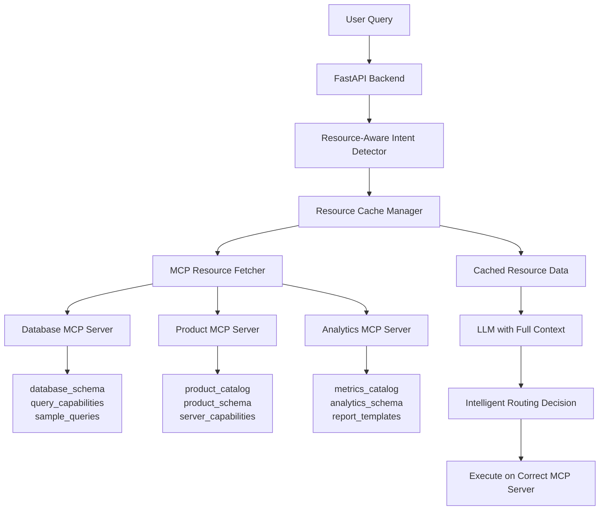

# MCP Resource-Based Routing Architecture

## Problem Statement

The current Multi-MCP Platform's routing system is fundamentally broken because it attempts to route queries to MCP servers without knowing what data each server actually contains. The system only knows tool names (e.g., `execute_query`, `lookup_product`) but has no visibility into the actual data (products, tables, schemas) managed by each server.

### Current Failure Example
```
User Query: "What is QuantumFlux DataProcessor?"
Current Behavior: Classified as "conversation" → No MCP server called
Expected Behavior: Classified as "product_lookup" → Product MCP server called
```

## Root Cause Analysis

### What Happens Now (BROKEN)
1. User sends query to FastAPI `/v2/chat` endpoint
2. Intent detector builds "capabilities context" containing only:
   - Server names
   - Tool names (operations)
   - Generic descriptions
3. LLM attempts routing with this limited context
4. LLM cannot identify "QuantumFlux DataProcessor" as a product because it doesn't know what products exist
5. Query gets misclassified as general conversation

### What's Missing
- **No Resource Data**: System never fetches MCP resources that describe actual data
- **No Product Knowledge**: LLM doesn't know product names, categories, or attributes
- **No Schema Knowledge**: LLM doesn't know database tables, columns, or relationships
- **Blind Routing**: LLM makes routing decisions without knowing what data exists where

## Proposed Solution: Resource-Based Intelligent Routing

### High-Level Architecture



### Component Details

#### 1. Resource Cache Manager
**Purpose**: Manage fetching, caching, and refreshing of MCP server resources

**Responsibilities**:
- Fetch all resources from all MCP servers at startup
- Cache resource data with TTL (Time To Live)
- Refresh resources periodically or on-demand
- Provide aggregated resource context for LLM

**Implementation Location**: `fastapi_server/resource_cache_manager.py`

#### 2. MCP Resource Fetcher
**Purpose**: Interface with MCP servers to retrieve resource data

**Responsibilities**:
- Call `list_resources()` on each MCP server
- Fetch each resource using `read_resource(uri)`
- Handle errors and timeouts gracefully
- Transform resource data into LLM-friendly format

**Implementation Location**: `fastapi_server/mcp_resource_fetcher.py`

#### 3. Enhanced Multi-Server Intent Detector
**Purpose**: Use complete resource knowledge for intelligent routing

**Modifications Required**:
- Replace `_build_server_capabilities_context()` with resource-aware version
- Include actual data listings in LLM prompts
- Cache routing decisions based on entity recognition

**Implementation Location**: Update `fastapi_server/multi_server_intent_detector.py`

## Detailed Implementation Plan

### Phase 1: Resource Fetching Infrastructure

#### Step 1.1: Create MCP Resource Fetcher
```python
# fastapi_server/mcp_resource_fetcher.py

from typing import Dict, List, Any, Optional
import asyncio
import logging
from .mcp_client_base import MCPClientBase

logger = logging.getLogger(__name__)

class MCPResourceFetcher:
    """Fetches and aggregates resources from MCP servers."""
    
    def __init__(self, mcp_clients: Dict[str, MCPClientBase]):
        """
        Initialize with MCP client instances.
        
        Args:
            mcp_clients: Map of server_id to MCP client instance
        """
        self.mcp_clients = mcp_clients
        self.resource_data: Dict[str, Dict[str, Any]] = {}
    
    async def fetch_all_server_resources(self) -> Dict[str, Dict[str, Any]]:
        """
        Fetch all resources from all configured MCP servers.
        
        Returns:
            Dictionary mapping server_id to their resources
            Example:
            {
                "database": {
                    "database_schema": {...},
                    "query_capabilities": {...}
                },
                "product_metadata": {
                    "product_catalog": {...},
                    "product_schema": {...}
                }
            }
        """
        results = {}
        
        for server_id, client in self.mcp_clients.items():
            try:
                # Step 1: List available resources
                resources = await client.list_resources()
                logger.info(f"Server {server_id} has {len(resources)} resources")
                
                # Step 2: Fetch each resource
                server_resources = {}
                for resource in resources:
                    resource_uri = resource.get('uri')
                    resource_name = resource.get('name', resource_uri)
                    
                    try:
                        # Fetch the actual resource data
                        resource_data = await client.read_resource(resource_uri)
                        server_resources[resource_uri] = {
                            'name': resource_name,
                            'data': resource_data,
                            'description': resource.get('description', ''),
                            'mime_type': resource.get('mimeType', 'application/json')
                        }
                        logger.debug(f"Fetched resource {resource_uri} from {server_id}")
                    except Exception as e:
                        logger.error(f"Failed to fetch resource {resource_uri}: {e}")
                        continue
                
                results[server_id] = server_resources
                
            except Exception as e:
                logger.error(f"Failed to fetch resources from {server_id}: {e}")
                results[server_id] = {}
        
        self.resource_data = results
        return results
    
    def get_server_resources(self, server_id: str) -> Dict[str, Any]:
        """Get cached resources for a specific server."""
        return self.resource_data.get(server_id, {})
    
    def extract_product_names(self) -> List[str]:
        """Extract all product names from product catalog resource."""
        product_resources = self.resource_data.get('product_metadata', {})
        catalog = product_resources.get('product_catalog', {})
        
        if catalog and 'data' in catalog:
            products = catalog['data'].get('products', [])
            return [p.get('name') for p in products if 'name' in p]
        return []
    
    def extract_database_tables(self) -> List[str]:
        """Extract all table names from database schema resource."""
        db_resources = self.resource_data.get('database', {})
        schema = db_resources.get('database_schema', {})
        
        if schema and 'data' in schema:
            tables = schema['data'].get('tables', [])
            return [t.get('name') for t in tables if 'name' in t]
        return []
```

#### Step 1.2: Create Resource Cache Manager
```python
# fastapi_server/resource_cache_manager.py

import asyncio
import time
from typing import Dict, Any, Optional
import logging
from datetime import datetime, timedelta

logger = logging.getLogger(__name__)

class ResourceCacheManager:
    """Manages caching and refreshing of MCP server resources."""
    
    def __init__(
        self,
        resource_fetcher: MCPResourceFetcher,
        cache_ttl_seconds: int = 3600,  # 1 hour default
        refresh_interval_seconds: int = 1800  # 30 minutes default
    ):
        """
        Initialize cache manager.
        
        Args:
            resource_fetcher: Instance of MCPResourceFetcher
            cache_ttl_seconds: Time to live for cached data
            refresh_interval_seconds: How often to refresh cache
        """
        self.fetcher = resource_fetcher
        self.cache_ttl = cache_ttl_seconds
        self.refresh_interval = refresh_interval_seconds
        
        self.cache: Dict[str, Any] = {}
        self.cache_timestamp: Optional[datetime] = None
        self.refresh_task: Optional[asyncio.Task] = None
        self._lock = asyncio.Lock()
    
    async def initialize(self):
        """Initialize cache with fresh data and start refresh task."""
        await self.refresh_cache()
        
        # Start background refresh task
        self.refresh_task = asyncio.create_task(self._periodic_refresh())
        logger.info("Resource cache manager initialized")
    
    async def refresh_cache(self):
        """Fetch fresh resource data from all MCP servers."""
        async with self._lock:
            try:
                logger.info("Refreshing MCP resource cache...")
                start_time = time.time()
                
                # Fetch all resources
                resources = await self.fetcher.fetch_all_server_resources()
                
                # Build enhanced cache with extracted entities
                self.cache = {
                    'raw_resources': resources,
                    'product_names': self.fetcher.extract_product_names(),
                    'database_tables': self.fetcher.extract_database_tables(),
                    'timestamp': datetime.now(),
                    'fetch_duration_ms': (time.time() - start_time) * 1000
                }
                
                self.cache_timestamp = datetime.now()
                
                logger.info(
                    f"Cache refreshed: {len(self.cache['product_names'])} products, "
                    f"{len(self.cache['database_tables'])} tables"
                )
                
            except Exception as e:
                logger.error(f"Failed to refresh cache: {e}")
    
    async def _periodic_refresh(self):
        """Background task to periodically refresh cache."""
        while True:
            try:
                await asyncio.sleep(self.refresh_interval)
                await self.refresh_cache()
            except asyncio.CancelledError:
                break
            except Exception as e:
                logger.error(f"Error in periodic refresh: {e}")
    
    def get_llm_context(self) -> str:
        """
        Generate LLM-friendly context from cached resources.
        
        Returns:
            Formatted string describing all available data across MCP servers
        """
        if not self.cache:
            return "No resource data available. MCP servers may be unavailable."
        
        context_parts = []
        
        # Add product information
        product_names = self.cache.get('product_names', [])
        if product_names:
            context_parts.append(
                f"Product MCP Server contains {len(product_names)} products:\n"
                f"Products: {', '.join(product_names[:10])}"
                f"{f' and {len(product_names)-10} more' if len(product_names) > 10 else ''}"
            )
        
        # Add database information
        db_tables = self.cache.get('database_tables', [])
        if db_tables:
            context_parts.append(
                f"Database MCP Server contains {len(db_tables)} tables:\n"
                f"Tables: {', '.join(db_tables)}"
            )
            
            # Add detailed schema if available
            db_resources = self.cache.get('raw_resources', {}).get('database', {})
            schema = db_resources.get('database_schema', {}).get('data', {})
            if schema and 'tables' in schema:
                for table in schema['tables'][:3]:  # Show first 3 tables
                    columns = table.get('columns', [])
                    col_names = [c.get('name') for c in columns if 'name' in c]
                    context_parts.append(
                        f"  - {table.get('name')}: {', '.join(col_names)}"
                    )
        
        return "\n\n".join(context_parts)
    
    def is_cache_valid(self) -> bool:
        """Check if cache is still valid based on TTL."""
        if not self.cache_timestamp:
            return False
        
        age = (datetime.now() - self.cache_timestamp).total_seconds()
        return age < self.cache_ttl
    
    async def shutdown(self):
        """Clean shutdown of cache manager."""
        if self.refresh_task:
            self.refresh_task.cancel()
            try:
                await self.refresh_task
            except asyncio.CancelledError:
                pass
```

### Phase 2: Integration with Intent Detection

#### Step 2.1: Update Multi-Server Intent Detector

```python
# Modifications to fastapi_server/multi_server_intent_detector.py

class MultiServerIntentDetector(EnhancedIntentDetector):
    def __init__(
        self,
        config: EnhancedIntentConfig,
        server_registry: MCPServerRegistry,
        resource_cache_manager: ResourceCacheManager  # NEW
    ):
        super().__init__(config)
        self.server_registry = server_registry
        self.resource_cache = resource_cache_manager  # NEW
        
    async def _build_server_capabilities_context(self) -> str:
        """
        Build context about available server capabilities WITH actual resource data.
        
        Returns:
            Formatted string with complete server data inventory
        """
        # Get cached resource context
        resource_context = self.resource_cache.get_llm_context()
        
        # Add tool/operation information
        capabilities_context = []
        
        for server_id in self.server_registry.get_enabled_servers():
            server_info = self.server_registry.get_server_info(server_id)
            server_caps = self.server_registry.get_server_capabilities(server_id)
            
            if server_info and server_caps:
                capabilities_context.append(
                    f"{server_info.name} Server ({server_id}):\n"
                    f"  Operations: {', '.join([op.value for op in server_caps.supported_operations])}\n"
                    f"  Status: {'✓ Healthy' if self.server_registry.is_server_healthy(server_id) else '✗ Unhealthy'}"
                )
        
        # Combine resource data with capabilities
        full_context = f"""
=== MCP SERVERS DATA INVENTORY ===

{resource_context}

=== SERVER CAPABILITIES ===

{chr(10).join(capabilities_context)}

=== ROUTING RULES ===

1. If query mentions ANY product name listed above → Route to product_metadata server
2. If query mentions database tables or SQL → Route to database server
3. If query combines product + sales/analytics → Route to BOTH servers (hybrid)
4. General questions without data needs → No server routing needed
"""
        return full_context
    
    async def _llm_classification_with_servers(
        self,
        query: str,
        metadata: Optional[Dict[str, Any]],
        start_time: float
    ) -> IntentDetectionResult:
        """Enhanced LLM classification with full resource awareness."""
        
        # Get complete context including resource data
        server_context = await self._build_server_capabilities_context()
        
        # Check for direct product name matches (optimization)
        product_names = self.resource_cache.cache.get('product_names', [])
        query_lower = query.lower()
        
        for product in product_names:
            if product.lower() in query_lower:
                # Direct match found - skip LLM
                return IntentDetectionResult(
                    classification=IntentClassification.PRODUCT_LOOKUP,
                    needs_database=False,
                    confidence=0.95,
                    detection_method=DetectionMethod.ENTITY_RECOGNITION,  # NEW
                    processing_time_ms=(time.time() - start_time) * 1000,
                    required_servers=["product_metadata"],
                    extracted_entities={"product_name": product},
                    reasoning=f"Direct product match: {product}"
                )
        
        # Continue with LLM classification but with enhanced context
        system_prompt = f"""You are an intelligent query router with COMPLETE knowledge of available data.

{server_context}

Your task: Route the user query to the appropriate MCP server(s).

IMPORTANT: You have the COMPLETE list of products and tables above. If the query mentions:
- Any product name from the list → MUST route to product_metadata 
- Any table from the database → MUST route to database
- Unknown product/table → Mark as CONVERSATION (don't guess)

Respond with JSON:
{{
    "classification": "PRODUCT_LOOKUP|PRODUCT_SEARCH|DATABASE_QUERY|HYBRID_QUERY|CONVERSATION|UNCLEAR",
    "confidence": 0.0-1.0,
    "required_servers": ["database", "product_metadata"],
    "reasoning": "explanation",
    "extracted_entities": {{"product_name": "...", "table_name": "..."}},
    "needs_database": true/false
}}
"""
        # ... rest of LLM classification logic
```

### Phase 3: FastAPI Integration

#### Step 3.1: Update Main Application

```python
# Modifications to fastapi_server/main.py

from fastapi import FastAPI
from contextlib import asynccontextmanager
from .mcp_resource_fetcher import MCPResourceFetcher
from .resource_cache_manager import ResourceCacheManager

@asynccontextmanager
async def lifespan(app: FastAPI):
    """Manage application lifecycle."""
    
    # Initialize MCP Platform
    platform = MCPPlatform()
    await platform.initialize()
    
    # Initialize Resource Fetcher with MCP clients
    mcp_clients = {
        "database": platform.database_client,
        "product_metadata": platform.product_client,
        # Add other clients as needed
    }
    resource_fetcher = MCPResourceFetcher(mcp_clients)
    
    # Initialize Resource Cache Manager
    cache_manager = ResourceCacheManager(
        resource_fetcher=resource_fetcher,
        cache_ttl_seconds=3600,  # 1 hour
        refresh_interval_seconds=1800  # 30 minutes
    )
    await cache_manager.initialize()
    
    # Update intent detector with cache manager
    platform.intent_detector = MultiServerIntentDetector(
        config=platform.config,
        server_registry=platform.server_registry,
        resource_cache_manager=cache_manager  # Pass cache manager
    )
    
    # Store in app state
    app.state.mcp_platform = platform
    app.state.resource_cache = cache_manager
    
    yield
    
    # Cleanup
    await cache_manager.shutdown()
    await platform.shutdown()
```

## Implementation Checklist

### Phase 1: Core Infrastructure (Day 1)
- [ ] Create `mcp_resource_fetcher.py` with resource fetching logic
- [ ] Create `resource_cache_manager.py` with caching and refresh logic
- [ ] Add resource-related models to `intent_models.py`
- [ ] Write unit tests for resource fetcher
- [ ] Write unit tests for cache manager

### Phase 2: Intent Detection Integration (Day 2)
- [ ] Update `multi_server_intent_detector.py` to use resource cache
- [ ] Add entity recognition for product/table names
- [ ] Update LLM prompts with resource context
- [ ] Add DetectionMethod.ENTITY_RECOGNITION enum value
- [ ] Write integration tests for resource-aware routing

### Phase 3: FastAPI Integration (Day 3)
- [ ] Update `main.py` lifespan to initialize resource cache
- [ ] Add resource cache health endpoint (`/health/resources`)
- [ ] Add manual cache refresh endpoint (`/admin/refresh-resources`)
- [ ] Update `/v2/chat` to use enhanced routing
- [ ] Write end-to-end tests

### Phase 4: Testing & Optimization (Day 4)
- [ ] Test with product queries: "What is QuantumFlux DataProcessor?"
- [ ] Test with database queries: "Show sales data"
- [ ] Test with hybrid queries: "QuantumFlux sales revenue"
- [ ] Optimize cache refresh strategy
- [ ] Add metrics for cache hit rate

## Expected Outcomes

### Before Implementation
```bash
curl -X POST "http://localhost:8001/v2/chat" -d '{"query": "What is QuantumFlux DataProcessor?"}'
# Result: {"intent": "conversation", "servers_used": []}  ❌
```

### After Implementation
```bash
curl -X POST "http://localhost:8001/v2/chat" -d '{"query": "What is QuantumFlux DataProcessor?"}'
# Result: {"intent": "product_lookup", "servers_used": ["product_metadata"], "product_data": {...}}  ✅
```

## Performance Considerations

### Resource Fetching
- **Initial Load**: ~200-500ms to fetch all resources at startup
- **Cache Refresh**: Background task, doesn't block requests
- **Memory Usage**: ~1-5MB for typical resource cache

### Routing Performance
- **Direct Entity Match**: ~1ms (bypass LLM entirely)
- **LLM with Context**: ~500ms (same as before but more accurate)
- **Cache Hit Rate**: Expected 80%+ for common queries

## Error Handling

### Graceful Degradation
1. If resource fetching fails → Fall back to tool-name-only routing
2. If specific resource fails → Continue with other resources
3. If all resources fail → Log error and use legacy detection

### Retry Strategy
- Exponential backoff for resource fetching
- Maximum 3 retries with 1s, 2s, 4s delays
- Circuit breaker pattern for consistently failing servers

## Monitoring & Observability

### Metrics to Track
- Resource cache hit rate
- Resource fetch latency
- Number of products/tables in cache
- Routing accuracy (via user feedback)
- Cache refresh frequency

### Logging
- INFO: Resource cache refreshed, products/tables count
- WARNING: Resource fetch failures, cache staleness
- ERROR: Complete fetch failures, fallback to legacy

## Security Considerations

### Resource Data Handling
- Never expose raw resource data to end users
- Sanitize resource data before LLM consumption
- Implement rate limiting on resource refresh endpoints

### Access Control
- Resource refresh endpoints require admin authentication
- Cache inspection endpoints are read-only
- Audit log all manual cache operations

## Migration Strategy

### Rollout Plan
1. **Stage 1**: Deploy with feature flag disabled (0% traffic)
2. **Stage 2**: Enable for 10% of queries, monitor accuracy
3. **Stage 3**: Increase to 50% if metrics are positive
4. **Stage 4**: Full rollout at 100%

### Rollback Plan
- Feature flag to instantly disable resource-based routing
- Fall back to current tool-name-only routing
- Preserve both code paths during transition period

## Appendix: Example Resource Data

### Product Catalog Resource Example
```json
{
  "uri": "product_catalog",
  "name": "Product Catalog",
  "mimeType": "application/json",
  "data": {
    "products": [
      {
        "id": "prod_001",
        "name": "QuantumFlux DataProcessor",
        "category": "AI/ML",
        "price": 15000,
        "description": "Advanced quantum computing processor"
      },
      {
        "id": "prod_002",
        "name": "Axios Gateway",
        "category": "Networking",
        "price": 5000,
        "description": "High-performance API gateway"
      }
    ]
  }
}
```

### Database Schema Resource Example
```json
{
  "uri": "database_schema",
  "name": "Database Schema",
  "mimeType": "application/json",
  "data": {
    "tables": [
      {
        "name": "sales",
        "columns": [
          {"name": "id", "type": "INTEGER"},
          {"name": "product_id", "type": "VARCHAR"},
          {"name": "amount", "type": "DECIMAL"},
          {"name": "date", "type": "DATE"}
        ]
      },
      {
        "name": "customers",
        "columns": [
          {"name": "id", "type": "INTEGER"},
          {"name": "name", "type": "VARCHAR"},
          {"name": "email", "type": "VARCHAR"}
        ]
      }
    ]
  }
}
```

## Conclusion

This architecture solves the fundamental routing problem by giving the LLM complete visibility into what data exists in each MCP server. Instead of routing blind with only tool names, the system will have full knowledge of products, tables, schemas, and other resources, enabling accurate and intelligent query routing.

The implementation is designed to be:
- **Performant**: Caching and entity recognition minimize LLM calls
- **Reliable**: Graceful degradation and error handling
- **Maintainable**: Clear separation of concerns and modular design
- **Scalable**: Supports unlimited MCP servers and resources

With this system, queries like "What is QuantumFlux DataProcessor?" will correctly route to the Product MCP server because the system KNOWS that QuantumFlux is a product in that server's catalog.