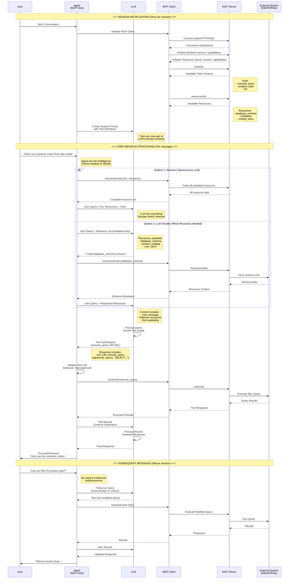

# MCP Architecture Flow Diagram

## Overview
This document illustrates the complete flow of the Model Context Protocol (MCP) when a user sends a message, showing the interaction between User, Agent (MCP Host), LLM, MCP Client, MCP Server, Resources, and Tools.

## Key Architectural Principles

### When Tools vs Resources are Used:
- **Tools**: Sent to LLM once during session initialization as part of the system prompt/function schema. LLM decides when to invoke them based on user queries.
- **Resources**: Discovered once per session but selectively injected into context by the Agent when relevant. Read-only contextual data.

### Information Flow Pattern:
- **NOT per-message discovery** - Discovery happens once per session
- **System prompt integration** - Tools become part of LLM's available functions
- **Selective context injection** - Resources added to prompts based on relevance

## Complete Message Flow Sequence Diagram



## Detailed Flow Explanation

### 1. Session Initialization Phase (Once per session)
- **Connection Setup**: Agent initializes MCP Client, establishes connection to MCP Server
- **Capability Discovery**: 
  - `initialize`: Exchange protocol versions and capabilities
  - `tools/list`: Discover all available tools (becomes part of LLM function schema)
  - `resources/list`: Discover all available resources (for selective context injection)
- **LLM Configuration**: Tools are integrated into LLM's system prompt/function calling schema

### 2. Message Processing Phase (Per user message)

**Critical Point: The Agent has NO intelligence - it cannot make ANY decisions!**

Resource selection can ONLY happen through:
- **Option 1 - Send All Resources**: Agent blindly sends all resources to LLM (simple but token-heavy)
- **Option 2 - LLM Selects Resources**: Two-step process where LLM first sees resource list and explicitly requests specific ones

The Agent CANNOT do any pattern matching, keyword analysis, or rule-based selection - it has zero intelligence.

After resources are determined:
- **LLM Processing**: LLM receives user message + selected resources + tool availability
- **Tool Invocation**: LLM decides which tools to call based on query requirements
- **Result Processing**: Tool results are sent back to LLM for final response generation

### 3. Key Decision Points

#### When Agent Sends Tool Information:
- **Once per session** during initialization
- Tools become part of LLM's persistent function schema
- Not resent with each message

#### When Agent Sends Resource Information:
- **Selectively per message** based on relevance
- Agent decides which resources to inject into context
- Resources provide read-only contextual data

## MCP Component Responsibilities

### Agent (MCP Host)
- Session management
- Protocol orchestration (zero intelligence)
- Context assembly (only following LLM instructions)
- User approval workflows
- Response formatting
- **ZERO intelligence** - cannot make ANY decisions, no pattern matching, no rules

### MCP Client
- Protocol communication
- Connection management
- Request/response handling
- Transport abstraction

### MCP Server
- Tool implementation
- Resource provision
- External system integration
- Security validation
- Query execution

### LLM
- Natural language understanding
- Tool selection logic
- Response generation
- Context utilization

## Resource Selection Approaches

Since the Agent has ZERO intelligence and cannot do ANY pattern matching or decision making:

### 1. Send All Resources (Simple but Token-Heavy)
```
How it works: Agent blindly fetches and sends ALL available resources to LLM
Pros: Simple implementation, LLM has full context
Cons: High token usage, potential context window limits
When to use: Small resource sets, simple applications
```

### 2. LLM-Driven Selection (Optimal)
```
How it works: Two-step process where LLM explicitly decides what it needs
Step 1: Agent sends user query + resource list (metadata only) to LLM
Step 2: LLM responds with specific resources it needs
Step 3: Agent fetches only requested resources and sends back to LLM

Pros: Intelligent selection, optimal token usage
Cons: Extra LLM call, increased latency
When to use: Large resource sets, complex queries
```

**Important**: The Agent CANNOT do any keyword matching, regex, pattern analysis, or rule-based decisions. It either sends everything or asks the LLM what to send.

## Best Practices

### Tool Usage
- Tools for **actions** with side effects
- LLM-controlled invocation
- Require explicit parameters
- Support error handling

### Resource Usage
- Resources for **contextual data**
- Host-controlled injection
- Read-only operations
- Minimize token usage

## Example Scenarios

### Scenario 1: Database Query
1. User asks about sales data
2. Agent either sends ALL resources OR asks LLM which resources needed
3. LLM (with resources) generates SQL using execute_query tool
4. Results formatted and returned

### Scenario 2: Multi-step Analysis
1. User requests complex analysis
2. LLM requests specific documentation resources it needs
3. Agent fetches exactly what LLM requested
4. LLM chains multiple tool calls for analysis
5. Progressive refinement of results

### Scenario 3: Context-Heavy Request
1. User asks about system configuration
2. Option A: Agent sends all available resources to LLM
   Option B: LLM first requests specific config resources
3. LLM synthesizes information from provided resources
4. Direct response from context without tool calls

## Transport Protocols

### stdio (Local Development)
```
User → CLI → MCP Server (same process)
```

### HTTP/SSE (Remote Access)
```
User → Web UI → HTTP → MCP Server (remote)
```

### WebSocket (Real-time)
```
User → App → WebSocket → MCP Server (bidirectional)
```

## Security Considerations

### Tool Invocation
- User approval for sensitive operations
- Parameter validation
- Audit logging
- Rate limiting

### Resource Access
- Access control lists
- Data filtering
- Token limits
- Privacy controls

## Performance Optimization

### Session Reuse
- Maintain persistent connections
- Cache tool/resource lists
- Reuse LLM context

### Selective Loading
- Lazy resource fetching
- Relevance scoring
- Context window management
- Incremental updates

## Summary

The MCP architecture follows a **session-based discovery** pattern where:
1. Tools and resources are discovered once during session initialization
2. Tools become part of the LLM's persistent function schema
3. Resources are either ALL sent to LLM or LLM explicitly requests what it needs
4. The Agent is a DUMB orchestrator with ZERO intelligence - no pattern matching, no rules, no decisions
5. Multiple messages reuse the same session without rediscovery

**Critical Understanding**:
- The Agent CANNOT analyze context
- The Agent CANNOT do pattern matching or keyword analysis
- The Agent CANNOT make decisions about which resources are relevant
- The Agent can ONLY: 
  - Send everything to the LLM, OR
  - Ask the LLM what it needs and fetch exactly that

This design optimizes for:
- **Simplicity**: Agent has no complex logic
- **Intelligence**: All decisions made by LLM
- **Flexibility**: LLM controls what it needs
- **Security**: Controlled tool invocation
- **Scalability**: Stateless message processing