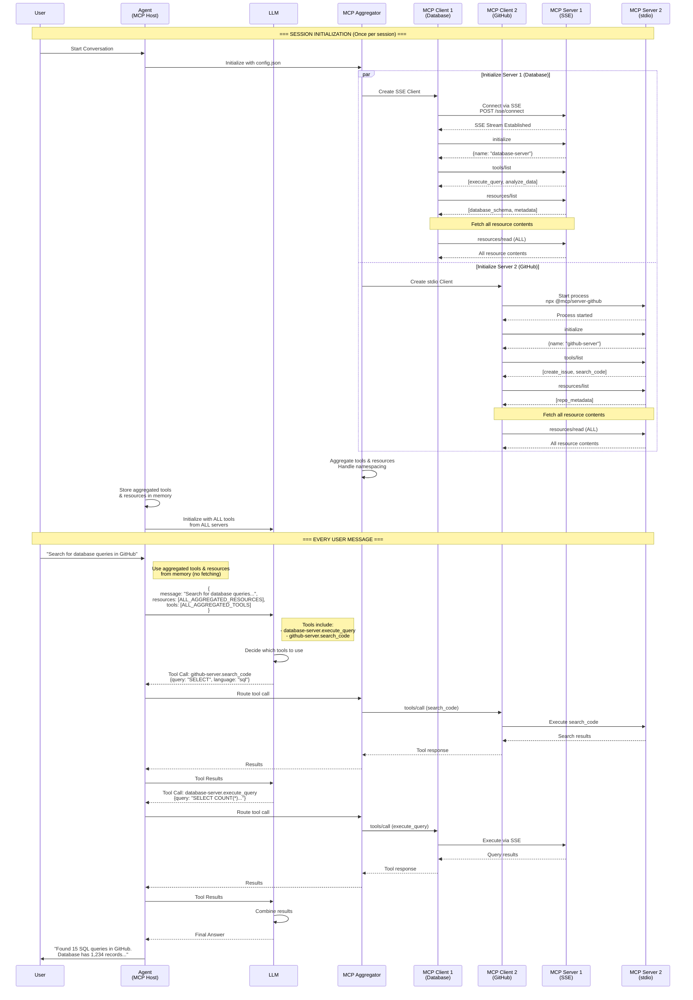

# Multi-MCP Server Configuration Architecture

## Executive Summary

This document describes the architecture for supporting multiple MCP (Model Context Protocol) servers through configuration files, eliminating the need for code changes when adding or removing MCP servers. The system will support multiple transport protocols (SSE, stdio, HTTP) and automatically aggregate tools and resources from all configured servers.

## Problem Statement

Current limitations:
- Only one MCP server supported
- Tightly coupled implementation
- Adding new servers requires code changes
- No dynamic server discovery or configuration

## Solution Overview

Implement a **plugin-based architecture** where MCP servers are:
1. Defined in JSON configuration files
2. Dynamically loaded at startup
3. Automatically aggregated for unified access
4. Namespace-isolated to prevent conflicts

## Architecture Components

### High-Level Architecture Diagram

```
┌──────────────────────────────────────────────────────────┐
│                     User Application                      │
└────────────────────────┬─────────────────────────────────┘
                         │
                         ▼
┌──────────────────────────────────────────────────────────┐
│                         Agent                             │
│                   (remains unchanged)                     │
└────────────────────────┬─────────────────────────────────┘
                         │
                         ▼
┌──────────────────────────────────────────────────────────┐
│                    MCP Aggregator                         │
│         (Unified interface for all MCP servers)          │
└────────────────────────┬─────────────────────────────────┘
                         │
            ┌────────────┼────────────┐
            ▼            ▼            ▼
┌──────────────┐ ┌──────────────┐ ┌──────────────┐
│ MCP Server 1 │ │ MCP Server 2 │ │ MCP Server N │
│   (SQLite)   │ │   (GitHub)   │ │ (Filesystem) │
└──────────────┘ └──────────────┘ └──────────────┘
```

### Detailed Sequence Flow Diagram (Multi-Server)



### Component Descriptions

#### 1. Configuration Loader
- **Purpose**: Parse and validate JSON configuration files
- **Responsibilities**:
  - Read JSON configuration
  - Validate schema
  - Substitute environment variables
  - Provide server configurations to factory

#### 2. MCP Client Factory
- **Purpose**: Create appropriate MCP client instances
- **Responsibilities**:
  - Create clients based on transport type
  - Configure client-specific settings
  - Handle connection parameters

#### 3. MCP Server Registry
- **Purpose**: Maintain registry of all active MCP servers
- **Responsibilities**:
  - Store active connections
  - Track server metadata
  - Provide server lookup by name
  - Handle connection lifecycle

#### 4. MCP Aggregator
- **Purpose**: Provide unified interface to multiple MCP servers
- **Responsibilities**:
  - Aggregate tools from all servers
  - Merge resources from all servers
  - Route tool calls to appropriate server
  - Handle namespace conflicts

## Configuration Schema

### Configuration File Format (JSON)

```json
{
  "version": "1.0",
  "metadata": {
    "description": "Multi-MCP Server Configuration",
    "created": "2024-01-20"
  },
  "defaults": {
    "timeout": 30000,
    "retry_attempts": 3
  },
  "servers": [
    {
      "name": "database-server",
      "enabled": true,
      "description": "SQLite database with customer data",
      "transport": "sse",
      "priority": 1,
      "config": {
        "endpoint": "http://localhost:8000",
        "headers": {
          "Authorization": "Bearer ${DB_TOKEN}"
        }
      }
    },
    {
      "name": "github-server",
      "enabled": true,
      "description": "GitHub repository access",
      "transport": "stdio",
      "priority": 2,
      "config": {
        "command": "npx",
        "args": ["-y", "@modelcontextprotocol/server-github"],
        "env": {
          "GITHUB_TOKEN": "${GITHUB_TOKEN}"
        }
      }
    },
    {
      "name": "filesystem-server",
      "enabled": false,
      "description": "Local filesystem access",
      "transport": "sse",
      "priority": 3,
      "config": {
        "endpoint": "http://localhost:8002",
        "allowed_directories": [
          "/home/user/projects",
          "/var/data"
        ]
      }
    },
    {
      "name": "remote-api-server",
      "enabled": true,
      "description": "Remote API integration",
      "transport": "http",
      "priority": 4,
      "config": {
        "endpoint": "https://api.example.com/mcp",
        "api_key": "${API_KEY}",
        "timeout": 60000
      }
    }
  ]
}
```

## Detailed Algorithms

### Algorithm 1: System Initialization

```
ALGORITHM: InitializeMultiMCPSystem
INPUT: config_file_path (string)
OUTPUT: aggregator (MCPAggregator instance)

1. VALIDATE config_file_path exists
   IF NOT exists:
      THROW ConfigurationError("Configuration file not found")

2. config = LoadConfiguration(config_file_path)
   
3. VALIDATE config against schema
   IF NOT valid:
      THROW ConfigurationError("Invalid configuration schema")

4. registry = NEW MCPServerRegistry()

5. successful_servers = []
   failed_servers = []

6. FOR each server IN config.servers:
   IF server.enabled == TRUE:
      TRY:
         client = CreateAndConnectServer(server)
         registry.register(server.name, client)
         successful_servers.append(server.name)
      CATCH error:
         LOG_ERROR("Failed to initialize {server.name}: {error}")
         failed_servers.append({name: server.name, error: error})

7. IF successful_servers.length == 0:
   THROW SystemError("No MCP servers could be initialized")

8. LOG_INFO("Initialized {successful_servers.length} servers")
   LOG_INFO("Failed servers: {failed_servers}")

9. aggregator = NEW MCPAggregator(registry)

10. RETURN aggregator
```

### Algorithm 2: Configuration Loading

```
ALGORITHM: LoadConfiguration
INPUT: file_path (string)
OUTPUT: config (Configuration object)

1. file_content = READ_FILE(file_path)

2. file_extension = GET_FILE_EXTENSION(file_path)

3. IF file_extension != '.json':
   THROW ConfigurationError("Only JSON configuration files are supported")

4. TRY:
   raw_config = PARSE_JSON(file_content)
CATCH parse_error:
   THROW ConfigurationError("Invalid JSON format: " + parse_error.message)

5. // Validate required fields
   IF NOT raw_config.version:
      THROW ConfigurationError("Missing required field: version")
   IF NOT raw_config.servers OR raw_config.servers.length == 0:
      THROW ConfigurationError("At least one server must be configured")

6. // Environment variable substitution
   processed_config = SubstituteEnvironmentVariables(raw_config)

7. // Apply defaults
   FOR each server IN processed_config.servers:
      IF server.timeout NOT defined:
         server.timeout = processed_config.defaults.timeout OR 30000
      IF server.retry_attempts NOT defined:
         server.retry_attempts = processed_config.defaults.retry_attempts OR 3

8. RETURN processed_config
```

### Algorithm 3: Environment Variable Substitution

```
ALGORITHM: SubstituteEnvironmentVariables
INPUT: config (object/dictionary)
OUTPUT: processed_config (object with substituted values)

1. config_string = SERIALIZE_TO_STRING(config)

2. // Find all environment variable placeholders
   placeholders = REGEX_FIND_ALL(r'\$\{([^}]+)\}', config_string)

3. FOR each placeholder IN placeholders:
   env_var_name = placeholder.group(1)
   env_value = GET_ENVIRONMENT_VARIABLE(env_var_name)
   
   IF env_value IS NULL:
      LOG_WARNING("Environment variable {env_var_name} not found")
      env_value = ""  // Or throw error based on requirements
   
   config_string = REPLACE(config_string, "${" + env_var_name + "}", env_value)

4. processed_config = DESERIALIZE_FROM_STRING(config_string)

5. RETURN processed_config
```

### Algorithm 4: Server Creation and Connection

```
ALGORITHM: CreateAndConnectServer
INPUT: server_config (ServerConfiguration)
OUTPUT: server_instance (ConnectedMCPServer)

1. // Create client based on transport type
   client = MCPClientFactory.create(server_config.transport, server_config.config)

2. // Connect to server
   connection_result = client.connect()
   
   IF connection_result.success == FALSE:
      THROW ConnectionError("Failed to connect: " + connection_result.error)

3. // Initialize session and discover capabilities
   client.initialize()

4. // Fetch tools list
   tools = client.list_tools()
   LOG_INFO("Server {server_config.name} provides {tools.length} tools")

5. // Fetch resources list
   resources_list = client.list_resources()
   LOG_INFO("Server {server_config.name} provides {resources_list.length} resources")

6. // Fetch all resource contents (as per architecture requirement)
   resource_contents = []
   FOR each resource IN resources_list:
      TRY:
         content = client.read_resource(resource.uri)
         resource_contents.append({
            uri: resource.uri,
            content: content,
            metadata: resource.metadata
         })
      CATCH error:
         LOG_ERROR("Failed to fetch resource {resource.uri}: {error}")
         resource_contents.append({
            uri: resource.uri,
            error: error.message,
            metadata: resource.metadata
         })

7. // Create server instance with all data
   server_instance = {
      name: server_config.name,
      client: client,
      tools: tools,
      resources: resource_contents,
      priority: server_config.priority,
      metadata: server_config
   }

8. RETURN server_instance
```

### Algorithm 5: MCP Client Factory

```
ALGORITHM: MCPClientFactory.create
INPUT: transport_type (string), config (object)
OUTPUT: client (MCPClient instance)

1. SWITCH transport_type:
   CASE "sse":
      client = NEW SSEMCPClient()
      client.endpoint = config.endpoint
      client.headers = config.headers OR {}
      client.timeout = config.timeout OR 30000
      
   CASE "stdio":
      client = NEW StdioMCPClient()
      client.command = config.command
      client.args = config.args OR []
      client.env = config.env OR {}
      
   CASE "http":
      client = NEW HTTPMCPClient()
      client.endpoint = config.endpoint
      client.api_key = config.api_key
      client.timeout = config.timeout OR 30000
      client.headers = config.headers OR {}
      
   DEFAULT:
      THROW ConfigurationError("Unsupported transport type: " + transport_type)

2. // Set common properties
   client.retry_attempts = config.retry_attempts OR 3
   client.retry_delay = config.retry_delay OR 1000

3. RETURN client
```

### Algorithm 6: Tool Aggregation

```
ALGORITHM: AggregateTools
INPUT: registry (MCPServerRegistry)
OUTPUT: aggregated_tools (dictionary)

1. aggregated_tools = {}
   conflicts = []

2. FOR each server IN registry.get_all_servers():
   FOR each tool IN server.tools:
      // Create namespaced tool name
      namespaced_name = server.name + "." + tool.name
      
      // Store with full metadata
      aggregated_tools[namespaced_name] = {
         server_name: server.name,
         original_name: tool.name,
         description: tool.description,
         schema: tool.schema,
         priority: server.priority
      }
      
      // Check for conflicts (same tool name across servers)
      IF tool.name IN aggregated_tools:
         conflicts.append({
            tool_name: tool.name,
            servers: [aggregated_tools[tool.name].server_name, server.name]
         })
      ELSE:
         // Also store without namespace for convenience (using priority)
         existing = FIND tool IN aggregated_tools WHERE tool.original_name == tool.name
         IF existing IS NULL OR server.priority > existing.priority:
            aggregated_tools[tool.name] = aggregated_tools[namespaced_name]

3. IF conflicts.length > 0:
   LOG_WARNING("Tool name conflicts detected: " + conflicts)
   LOG_INFO("Use namespaced names to explicitly specify server")

4. RETURN aggregated_tools
```

### Algorithm 7: Resource Aggregation

```
ALGORITHM: AggregateResources
INPUT: registry (MCPServerRegistry)
OUTPUT: aggregated_resources (array)

1. aggregated_resources = []
   resource_map = {}  // For deduplication

2. FOR each server IN registry.get_all_servers():
   FOR each resource IN server.resources:
      // Create unique key for resource
      resource_key = server.name + ":" + resource.uri
      
      // Add server context to resource
      enriched_resource = {
         server_name: server.name,
         uri: resource.uri,
         content: resource.content,
         metadata: resource.metadata,
         priority: server.priority,
         original_uri: resource.uri,
         namespaced_uri: server.name + ":" + resource.uri
      }
      
      // Check for duplicate URIs across servers
      IF resource.uri IN resource_map:
         LOG_WARNING("Duplicate resource URI {resource.uri} from servers: " +
                    resource_map[resource.uri].server_name + ", " + server.name)
         
         // Keep higher priority resource
         IF server.priority > resource_map[resource.uri].priority:
            resource_map[resource.uri] = enriched_resource
      ELSE:
         resource_map[resource.uri] = enriched_resource
      
      // Always add namespaced version
      aggregated_resources.append(enriched_resource)

3. RETURN aggregated_resources
```

### Algorithm 8: Tool Execution Routing

```
ALGORITHM: ExecuteTool
INPUT: tool_name (string), arguments (object), registry (MCPServerRegistry)
OUTPUT: result (object)

1. // Parse tool name to determine target server
   server_name = NULL
   actual_tool_name = NULL
   
2. IF tool_name CONTAINS ".":
   // Namespaced tool name (e.g., "database-server.execute_query")
   parts = SPLIT(tool_name, ".")
   server_name = parts[0]
   actual_tool_name = JOIN(parts[1:], ".")  // Handle nested dots
ELSE:
   // Non-namespaced, use priority-based resolution
   aggregated_tools = AggregateTools(registry)
   IF tool_name IN aggregated_tools:
      server_name = aggregated_tools[tool_name].server_name
      actual_tool_name = aggregated_tools[tool_name].original_name
   ELSE:
      THROW ToolNotFoundError("Tool {tool_name} not found in any server")

3. // Get target server
   server = registry.get_server(server_name)
   IF server IS NULL:
      THROW ServerNotFoundError("Server {server_name} not found")

4. // Validate tool exists on server
   tool_exists = FALSE
   FOR each tool IN server.tools:
      IF tool.name == actual_tool_name:
         tool_exists = TRUE
         BREAK
   
   IF NOT tool_exists:
      THROW ToolNotFoundError("Tool {actual_tool_name} not found on server {server_name}")

5. // Execute tool on target server
   TRY:
      LOG_INFO("Executing {actual_tool_name} on {server_name}")
      result = server.client.call_tool(actual_tool_name, arguments)
      LOG_INFO("Tool execution successful")
      RETURN result
   CATCH error:
      LOG_ERROR("Tool execution failed: {error}")
      THROW ToolExecutionError("Failed to execute {tool_name}: {error}")
```

### Algorithm 9: Message Processing with Aggregator

```
ALGORITHM: ProcessMessageWithAggregator
INPUT: user_message (string), aggregator (MCPAggregator)
OUTPUT: response (string)

1. // Get all aggregated tools and resources
   all_tools = aggregator.get_all_tools()
   all_resources = aggregator.get_all_resources()

2. // Prepare context for LLM
   context = {
      message: user_message,
      tools: all_tools,
      resources: all_resources,
      metadata: {
         total_servers: aggregator.registry.count(),
         server_names: aggregator.registry.get_server_names()
      }
   }

3. // Send to LLM with full context
   llm_response = LLM.process(context)

4. // Handle tool calls if any
   IF llm_response.has_tool_calls():
      FOR each tool_call IN llm_response.tool_calls:
         TRY:
            // Route tool call to appropriate server
            result = aggregator.execute_tool(
               tool_call.name,
               tool_call.arguments
            )
            
            // Add result to LLM context
            LLM.add_tool_result(tool_call.id, result)
            
         CATCH error:
            LOG_ERROR("Tool call failed: {error}")
            LLM.add_tool_error(tool_call.id, error.message)
      
      // Get final response after tool execution
      final_response = LLM.get_final_response()
   ELSE:
      final_response = llm_response.content

5. RETURN final_response
```

### Algorithm 10: Graceful Degradation

```
ALGORITHM: HandleServerFailure
INPUT: server_name (string), error (Error), registry (MCPServerRegistry)
OUTPUT: recovery_action (string)

1. LOG_ERROR("Server {server_name} failed: {error}")

2. // Check if server is critical
   server = registry.get_server(server_name)
   IF server.metadata.critical == TRUE:
      // Critical server failed, need immediate action
      ALERT_ADMIN("Critical server {server_name} failed")
      
      // Try to reconnect
      retry_count = 0
      WHILE retry_count < 3:
         WAIT(2^retry_count * 1000)  // Exponential backoff
         TRY:
            server.client.reconnect()
            LOG_INFO("Successfully reconnected to {server_name}")
            RETURN "RECOVERED"
         CATCH reconnect_error:
            retry_count++
      
      RETURN "CRITICAL_FAILURE"
   
3. // Non-critical server, mark as unavailable
   registry.mark_unavailable(server_name)
   
4. // Remove server's tools and resources from aggregation
   aggregator.remove_server_capabilities(server_name)
   
5. LOG_WARNING("Server {server_name} marked unavailable, continuing with remaining servers")

6. RETURN "DEGRADED"
```

## Implementation Guidelines for Junior Developers

### 1. Project Structure

```
project/
├── config/
│   ├── mcp-config.json          # Main configuration file
│   └── mcp-config.example.json  # Example configuration
├── src/
│   ├── core/
│   │   ├── config_loader.py     # Algorithm 2, 3
│   │   ├── mcp_client_factory.py # Algorithm 5
│   │   ├── mcp_registry.py      # Registry implementation
│   │   └── mcp_aggregator.py    # Algorithm 6, 7, 8
│   ├── clients/
│   │   ├── base_client.py       # Abstract base class
│   │   ├── sse_client.py        # SSE transport
│   │   ├── stdio_client.py      # Stdio transport
│   │   └── http_client.py       # HTTP transport
│   └── main.py                   # Algorithm 1, 9
├── tests/
│   ├── test_config_loader.py
│   ├── test_aggregator.py
│   └── test_integration.py
└── requirements.txt
```

### 2. Implementation Steps

#### Phase 1: Configuration System (Week 1)
1. Implement configuration loader (Algorithm 2)
2. Implement environment variable substitution (Algorithm 3)
3. Create configuration validation
4. Write unit tests for configuration

#### Phase 2: Client Factory and Registry (Week 2)
1. Create base MCP client interface
2. Implement client factory (Algorithm 5)
3. Implement server registry
4. Write unit tests for factory and registry

#### Phase 3: Aggregation Layer (Week 3)
1. Implement tool aggregation (Algorithm 6)
2. Implement resource aggregation (Algorithm 7)
3. Implement tool routing (Algorithm 8)
4. Write unit tests for aggregation

#### Phase 4: Integration (Week 4)
1. Implement main initialization (Algorithm 1)
2. Integrate with existing Agent
3. Implement graceful degradation (Algorithm 10)
4. End-to-end testing

### 3. Key Implementation Notes

#### A. Error Handling
- Every algorithm should have try-catch blocks
- Log all errors with appropriate severity
- Provide meaningful error messages
- Implement circuit breaker pattern for failing servers

#### B. Logging
```
- INFO: Server connections, tool discoveries
- WARNING: Conflicts, degraded functionality
- ERROR: Connection failures, tool execution errors
- DEBUG: Detailed protocol messages
```

#### C. Testing Strategy
1. **Unit Tests**: Each algorithm independently
2. **Integration Tests**: Multi-server scenarios
3. **Failure Tests**: Server disconnection handling
4. **Configuration Tests**: Various config formats

#### D. Performance Considerations
- Initialize all servers in parallel where possible
- Use connection pooling for HTTP/SSE
- Implement timeout for all network operations
- Consider lazy loading for large resource sets

### 4. Configuration Best Practices

#### A. Environment Variables
- Never hardcode secrets
- Use ${VAR_NAME} syntax consistently
- Document all required environment variables
- Provide sensible defaults where appropriate

#### B. Server Naming
- Use descriptive, kebab-case names
- Avoid special characters except hyphen
- Keep names unique and meaningful
- Consider namespace prefixes for grouping

#### C. Priority Assignment
- Higher numbers = higher priority
- Use increments of 10 for easy insertion
- Document priority resolution logic
- Consider making priority optional with auto-assignment

### 5. Common Pitfalls to Avoid

1. **Don't block on failed servers** - Continue with available servers
2. **Don't assume tool names are unique** - Always implement namespacing
3. **Don't fetch resources on every message** - Follow the in-memory pattern
4. **Don't ignore transport-specific requirements** - Each transport has unique needs
5. **Don't hardcode configuration paths** - Make them configurable

### 6. Validation Checklist

Before considering implementation complete:

- [ ] Configuration file can be changed without code modification
- [ ] New servers can be added by editing config only
- [ ] Servers can be enabled/disabled via config
- [ ] Tool name conflicts are handled gracefully
- [ ] Failed servers don't crash the system
- [ ] All transports (SSE, stdio, HTTP) work correctly
- [ ] Environment variables are properly substituted
- [ ] Appropriate logging at all levels
- [ ] Comprehensive error messages
- [ ] Unit tests cover all algorithms
- [ ] Integration tests cover multi-server scenarios
- [ ] Documentation is complete and clear

## Testing Scenarios

### Scenario 1: Basic Multi-Server Setup
```json
{
  "servers": [
    {
      "name": "test-db",
      "transport": "sse",
      "config": {
        "endpoint": "http://localhost:8000"
      }
    },
    {
      "name": "test-stdio",
      "transport": "stdio",
      "config": {
        "command": "echo",
        "args": ["test"]
      }
    }
  ]
}
```

### Scenario 2: Tool Name Conflict
```json
{
  "servers": [
    {
      "name": "db1",
      "priority": 1
    },
    {
      "name": "db2",
      "priority": 2
    }
  ]
}
```

### Scenario 3: Server Failure
```
1. Start with 3 servers
2. Disconnect one server
3. System should continue with 2 servers
4. Verify tools/resources from failed server are unavailable
5. Verify other servers still functional
```

### Scenario 4: Configuration Hot-Reload (Future)
```
1. Start system with config A
2. Modify config file
3. Trigger reload (or auto-detect)
4. Verify new servers are added
5. Verify removed servers are disconnected
```

## Monitoring and Observability

### Metrics to Track
1. **Server Health**
   - Connection status per server
   - Last successful communication
   - Error rate per server
   - Response time per server

2. **Tool Usage**
   - Tool invocation count by server
   - Tool execution time
   - Tool failure rate
   - Most used tools

3. **Resource Usage**
   - Resource fetch time at initialization
   - Resource size in memory
   - Resource access patterns

### Health Check Endpoint
```
GET /health/mcp-servers

Response:
{
  "status": "healthy|degraded|unhealthy",
  "servers": {
    "database-server": {
      "status": "connected",
      "tools": 5,
      "resources": 3,
      "last_ping": "2024-01-20T10:30:00Z"
    },
    "github-server": {
      "status": "disconnected",
      "error": "Connection timeout",
      "last_ping": "2024-01-20T10:25:00Z"
    }
  },
  "totals": {
    "connected_servers": 1,
    "total_servers": 2,
    "total_tools": 5,
    "total_resources": 3
  }
}
```

## Security Considerations

### 1. Configuration Security
- Store configuration files with restricted permissions (600)
- Encrypt sensitive configuration sections
- Audit configuration changes
- Validate all configuration inputs

### 2. Transport Security
- Use HTTPS for HTTP/SSE transports
- Implement authentication for remote servers
- Use API keys/tokens from environment variables
- Implement rate limiting per server

### 3. Tool Execution Security
- Validate all tool arguments
- Implement execution sandboxing where possible
- Log all tool executions for audit
- Implement tool-level permissions (future)

## Future Enhancements (Out of MVP Scope)

1. **Dynamic Server Discovery**
   - Service mesh integration
   - DNS-based discovery
   - Consul/etcd integration

2. **Advanced Routing**
   - Load balancing across similar servers
   - Failover strategies
   - Request routing based on content

3. **Caching Layer**
   - Cache resource contents
   - Cache tool results
   - Distributed cache support

4. **Management UI**
   - Web interface for configuration
   - Real-time server monitoring
   - Tool execution history

5. **Advanced Features**
   - Server health checks
   - Automatic retry with backoff
   - Circuit breaker pattern
   - Request tracing
   - Distributed tracing integration

## Conclusion

This architecture provides a clean, extensible solution for supporting multiple MCP servers through configuration. The key principles are:

1. **Zero code changes** for adding/removing servers
2. **Simple JSON configuration** format
3. **Graceful degradation** when servers fail
4. **Clear separation of concerns** between components
5. **Extensible design** for future enhancements

The implementation should focus on simplicity and reliability for the MVP, with clear extension points for future enhancements.