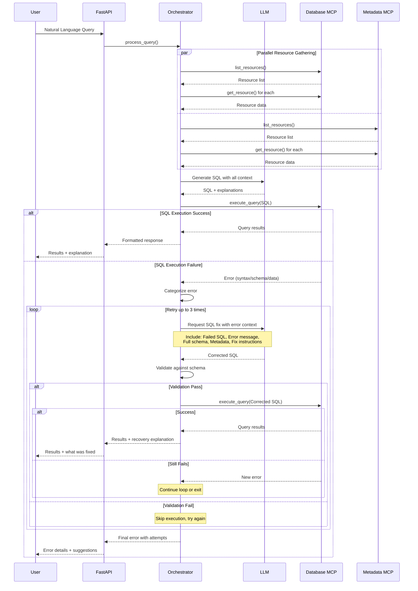

# Multi-MCP Support Architecture

## Executive Summary

This document describes the architecture for implementing multi-MCP (Model Context Protocol) server support in the Talk 2 Tables system. The system will enable intelligent query routing across multiple specialized MCP servers, with the initial implementation supporting two servers: a Database MCP server (existing) and a Product Metadata MCP server (new).

## Table of Contents

1. [System Overview](#system-overview)
2. [Architecture Principles](#architecture-principles)
3. [Component Architecture](#component-architecture)
4. [Core Algorithms](#core-algorithms)
5. [Data Structures](#data-structures)
6. [Configuration Schemas](#configuration-schemas)
7. [Data Flow Patterns](#data-flow-patterns)
8. [API Specifications](#api-specifications)
9. [Error Handling Strategy](#error-handling-strategy)
10. [Logging Architecture](#logging-architecture)
11. [Testing Strategy](#testing-strategy)
12. [Implementation Phases](#implementation-phases)

## System Overview

### Current State
- Single MCP server (Database MCP) handling SQL queries
- FastAPI backend with single MCP client integration
- React frontend for user interaction

### Target State
- Multiple MCP servers with specialized domains
- Intelligent orchestration layer in FastAPI
- LLM-based query planning and SQL generation
- Unified query interface for users

### MCP Server Landscape

| Server | Purpose | Capabilities | Priority |
|--------|---------|--------------|----------|
| Database MCP | SQL queries on sales, orders, transactions | execute_query, list_resources | 10 |
| Product Metadata MCP | Product aliases, column mappings | list_resources only | 1 |

**Note**: Priority is inverse - lower number means higher priority.

## Architecture Principles

### Core Decisions

1. **Static Configuration**: MCP servers registered via configuration file
2. **Priority-based Resolution**: Lower priority number = higher preference
3. **Pure LLM Approach**: No regex or rule-based matching
4. **Fail-Fast Philosophy**: Complete success or complete failure, no partial results
5. **Resource-First Strategy**: Gather all resources before query processing
6. **Comprehensive Logging**: Structured JSON logging for all operations
7. **Clean Exception Handling**: Specific exception types for each failure mode
8. **Minimal Caching**: Only cache MCP resource lists
9. **No Timeout Budgets**: Operations run to completion
10. **Independent Phases**: Each implementation phase is self-contained

## Component Architecture

### High-Level Architecture

```
┌─────────────┐
│   React     │
│  Frontend   │
└──────┬──────┘
       │ HTTP
       ▼
┌─────────────┐
│   FastAPI   │
│   Backend   │
│(Orchestrator)│
└──────┬──────┘
       │
   ┌───┴────┬─────────┐
   │        │         │
   ▼        ▼         ▼
┌──────┐ ┌──────┐ ┌──────┐
│ MCP  │ │ MCP  │ │Future│
│Server│ │Server│ │ MCP  │
│  #1  │ │  #2  │ │  #n  │
└──────┘ └──────┘ └──────┘
```

### Component Responsibilities

#### 1. Product Metadata MCP Server (NEW)

**Location**: `src/product_metadata_mcp/`

**Purpose**: Provides product aliases and column mappings for query translation

**Key Responsibilities**:
- Serve product alias mappings via resources
- Provide column name translations
- Expose metadata through MCP protocol
- Support both stdio and SSE transports

**Resources to Expose**:
- `product_aliases` - Maps user terms to canonical product IDs
- `column_mappings` - Maps user-friendly terms to SQL columns
- `metadata_summary` - Overview of available metadata

#### 2. MCP Orchestrator (NEW)

**Location**: `fastapi_server/mcp_orchestrator.py`

**Purpose**: Manages multiple MCP client connections and coordinates query processing

**Key Responsibilities**:
- Load and validate MCP configuration from YAML
- Initialize and maintain multiple MCP client connections
- Gather resources from all connected MCPs
- Coordinate with LLM for SQL generation
- Route SQL execution to appropriate MCP
- Handle failures with proper exception propagation

#### 3. LLM SQL Generator (ENHANCED)

**Location**: `fastapi_server/llm_sql_generator.py`

**Purpose**: Generate SQL queries using LLM with full metadata context

**Key Responsibilities**:
- Build comprehensive prompts with all MCP resources
- Handle entity resolution via metadata
- Translate user-friendly terms to SQL
- Parse and validate LLM responses

## Core Algorithms

### Algorithm 1: Multi-MCP Query Processing

```
ALGORITHM: ProcessUserQuery
INPUT: user_query (string), llm_client (LLM interface)
OUTPUT: query_result (dictionary with results or error)

1. START transaction timer
2. INITIALIZE empty resource collection
3. FOR each registered MCP server in configuration:
   a. IF server is connected:
      i. FETCH all resources from server
      ii. STORE resources with server priority
   b. ELSE IF fail_fast is enabled:
      i. RAISE MCPConnectionError
   c. ELSE:
      i. LOG warning and continue
4. IF resource collection is empty:
   a. RAISE NoMCPAvailableError
5. CALL GenerateSQLWithLLM(user_query, resource_collection, llm_client)
6. EXTRACT sql_query from LLM response
7. FIND database MCP server (one with execute_query capability)
8. EXECUTE sql_query on database MCP
9. CALCULATE execution time
10. RETURN structured response with results and metadata
11. ON ANY ERROR:
    a. LOG error with full context
    b. RETURN error response
```

### Algorithm 2: Resource Gathering with Cache

```
ALGORITHM: GatherAllResources
INPUT: mcp_clients (dictionary of MCP connections)
OUTPUT: all_resources (dictionary of server resources)

1. INITIALIZE empty resource dictionary
2. FOR each server_name, server_info in mcp_clients:
   a. CHECK if server is connected
   b. IF not connected:
      i. SKIP to next server
   c. CALCULATE cache_key from server_name
   d. IF cache is valid for cache_key:
      i. USE cached resources
      ii. CONTINUE to next server
   e. INITIALIZE resource list for server
   f. CALL server.list_resources()
   g. FOR each resource in resource list:
      i. FETCH resource data via server.get_resource(resource.uri)
      ii. STORE in resource dictionary
   h. UPDATE cache with new resources
   i. SET cache timestamp
3. RETURN all_resources sorted by server priority
```

### Algorithm 3: LLM-based SQL Generation

```
ALGORITHM: GenerateSQLWithLLM
INPUT: user_query, all_resources, llm_client
OUTPUT: sql_generation_result (dictionary)

1. SORT all_resources by priority (ascending)
2. BUILD prompt string:
   a. ADD user query
   b. FOR each server in sorted resources:
      i. ADD server name and priority
      ii. ADD server domains and capabilities
      iii. ADD server resources as JSON
   c. ADD instructions for SQL generation
   d. ADD response format specification
3. SEND prompt to LLM
4. RECEIVE LLM response
5. PARSE response:
   a. TRY parse as JSON
   b. IF JSON parsing fails:
      i. EXTRACT SQL using pattern matching
      ii. CREATE minimal response structure
6. VALIDATE response contains required fields:
   a. sql_query (required)
   b. resolved_entities (optional)
   c. explanation (optional)
7. RETURN parsed response
```

### Algorithm 4: Priority-based Resource Resolution

```
ALGORITHM: ResolveEntityWithPriority
INPUT: entity_name, resource_type, all_resources
OUTPUT: resolved_entity (dictionary)

1. INITIALIZE candidates list
2. FOR each server in all_resources (sorted by priority):
   a. IF server has resource_type in domains:
      i. SEARCH for entity_name in server resources
      ii. IF found:
         - ADD to candidates with server priority
3. IF candidates is not empty:
   a. RETURN candidate with lowest priority number
4. ELSE:
   a. RETURN null (entity not found)
```

### Algorithm 5: SQL Execution Failure Recovery

```
ALGORITHM: HandleSQLExecutionFailure
INPUT: failed_sql, error_message, user_query, all_resources, llm_client, attempt_number
OUTPUT: recovery_result (dictionary with new SQL or final error)

1. IF attempt_number >= MAX_RETRY_ATTEMPTS (default: 3):
   a. LOG final failure with all attempts
   b. RETURN final error response
   
2. ANALYZE error_message to categorize failure:
   a. SYNTAX_ERROR: SQL syntax issues
   b. MISSING_COLUMN: Referenced column doesn't exist
   c. MISSING_TABLE: Referenced table doesn't exist
   d. DATA_TYPE_MISMATCH: Type conversion errors
   e. PERMISSION_ERROR: Access denied
   f. UNKNOWN_ERROR: Other failures

3. IF error_type is PERMISSION_ERROR:
   a. RETURN error immediately (no retry)
   
4. BUILD enhanced prompt for LLM:
   a. INCLUDE original user query
   b. INCLUDE failed SQL query
   c. INCLUDE specific error message
   d. INCLUDE all MCP resources (schemas, metadata)
   e. ADD explicit instructions based on error type:
      - For SYNTAX_ERROR: "Fix SQL syntax"
      - For MISSING_COLUMN: "Use correct column names from schema"
      - For MISSING_TABLE: "Use correct table names from schema"
      - For DATA_TYPE_MISMATCH: "Ensure proper type casting"
   f. ADD examples of correct SQL for similar queries
   
5. SEND enhanced prompt to LLM with error context
6. RECEIVE corrected SQL from LLM
7. VALIDATE corrected SQL:
   a. CHECK for obvious issues (empty, malformed)
   b. VERIFY referenced tables exist in schema
   c. VERIFY referenced columns exist in schema
   
8. IF validation passes:
   a. LOG retry attempt with corrections
   b. EXECUTE corrected SQL on database MCP
   c. IF execution succeeds:
      i. RETURN success with explanation of fix
   d. ELSE:
      i. INCREMENT attempt_number
      ii. RECURSIVELY call HandleSQLExecutionFailure
      
9. ELSE (validation fails):
   a. INCREMENT attempt_number
   b. RECURSIVELY call with additional context
```

## Data Structures

### MCP Registry Structure

```yaml
Structure: MCP_Registry
Fields:
  - mcp_servers: Map<string, MCP_Config>
  - orchestration: Orchestration_Config

MCP_Config:
  - name: string
  - url: string
  - priority: integer (1-999)
  - domains: List<string>
  - capabilities: List<string>
  - transport: string

Orchestration_Config:
  - resource_cache_ttl: integer (seconds)
  - fail_fast: boolean
  - enable_logging: boolean
  - log_level: string
```

### Resource Cache Structure

```yaml
Structure: Resource_Cache
Fields:
  - cache_data: Map<string, Resource_Data>
  - cache_timestamps: Map<string, timestamp>

Resource_Data:
  - priority: integer
  - domains: List<string>
  - capabilities: List<string>
  - resources: Map<string, any>
```

### Product Metadata Structure

```yaml
Structure: Product_Metadata
Fields:
  - product_aliases: Map<string, Product_Alias>
  - column_mappings: Column_Mappings
  - last_updated: timestamp

Product_Alias:
  - canonical_id: string
  - canonical_name: string
  - aliases: List<string>
  - database_references: Map<string, any>
  - categories: List<string>

Column_Mappings:
  - user_friendly_terms: Map<string, string>
  - aggregation_terms: Map<string, string>
  - table_aliases: Map<string, List<string>>
```

### Query Processing Result Structure

```yaml
Structure: Query_Result
Fields:
  - success: boolean
  - query: string (original user query)
  - sql: string (generated SQL)
  - result: Query_Data (if success)
  - error: string (if failure)
  - explanation: string
  - resolved_entities: Map<string, Map<string, string>>
  - metadata: Execution_Metadata

Query_Data:
  - columns: List<string>
  - rows: List<List<any>>

Execution_Metadata:
  - execution_time: float (seconds)
  - mcp_servers_used: List<string>
  - timestamp: ISO8601 string
```

## Configuration Schemas

### MCP Configuration Schema (YAML)

```yaml
# Location: fastapi_server/mcp_config.yaml
mcp_servers:
  database_mcp:
    name: "Database MCP Server"
    url: "http://localhost:8000/sse"
    priority: 10  # Lower number = higher priority
    domains:
      - sales
      - transactions
      - orders
      - products
    capabilities:
      - execute_query
      - list_resources
    transport: "sse"
    
  product_metadata_mcp:
    name: "Product Metadata MCP"
    url: "http://localhost:8002/sse"
    priority: 1  # Higher priority for product information
    domains:
      - products
      - product_aliases
      - column_mappings
    capabilities:
      - list_resources
    transport: "sse"

orchestration:
  resource_cache_ttl: 300  # 5 minutes in seconds
  fail_fast: true
  enable_logging: true
  log_level: "DEBUG"
```

### Product Metadata Schema (JSON)

```json
{
    "last_updated": "2024-01-15T10:00:00Z",
    "product_aliases": {
        "abracadabra": {
            "canonical_id": "PROD_123",
            "canonical_name": "Magic Wand Pro",
            "aliases": ["abra", "cadabra", "magic_wand"],
            "database_references": {
                "products.product_name": "Magic Wand Pro",
                "products.product_id": 123
            },
            "categories": ["entertainment", "magic"]
        }
    },
    "column_mappings": {
        "user_friendly_terms": {
            "sales amount": "sales.total_amount",
            "this month": "DATE_TRUNC('month', {date_column}) = DATE_TRUNC('month', CURRENT_DATE)"
        }
    }
}
```

## Data Flow Patterns

### Query Processing Flow (With SQL Failure Handling)



### SQL Failure Recovery Flow

```
1. Initial SQL Execution Fails
   ↓
2. Error Categorization:
   - SYNTAX_ERROR → Fix SQL syntax
   - MISSING_COLUMN → Correct column names
   - MISSING_TABLE → Correct table names
   - DATA_TYPE_MISMATCH → Add type casting
   - PERMISSION_ERROR → Fail immediately (no retry)
   ↓
3. Build Recovery Context:
   - Original user query: "sales for abracadabra this month"
   - Failed SQL: "SELECT * FROM sale WHERE product = 'abracadabra'"
   - Error: "Table 'sale' not found"
   - Available tables: [sales, products, orders]
   - Product metadata: {abracadabra → product_id: 123}
   ↓
4. LLM Correction Request:
   - Send comprehensive context to LLM
   - Request specific fix based on error type
   - Include examples of correct syntax
   ↓
5. Validation Before Retry:
   - Check tables exist: sales ✓
   - Check columns exist: product_id ✓
   - Verify syntax: SELECT statement valid ✓
   ↓
6. Execute Corrected SQL:
   "SELECT SUM(total_amount) FROM sales 
    WHERE product_id = 123 
    AND DATE_TRUNC('month', sale_date) = DATE_TRUNC('month', CURRENT_DATE)"
   ↓
7. Success or Further Retry (max 3 attempts)
```

### Resource Resolution Pattern

```
1. User Query: "sales for abracadabra this month"
   ↓
2. Resource Collection Phase:
   - Metadata MCP (Priority 1): {product_aliases, column_mappings}
   - Database MCP (Priority 10): {table_schemas, available_tables}
   ↓
3. LLM Processing:
   Input: Query + All Resources (sorted by priority)
   Processing:
   - Resolve "abracadabra" → product_id: 123 (from metadata)
   - Translate "this month" → DATE_TRUNC expression (from mappings)
   - Identify target table: "sales" (from database schema)
   Output: Generated SQL with resolved entities
   ↓
4. Execution:
   Database MCP executes: SELECT SUM(total_amount) FROM sales WHERE...
   ↓
5. Response Assembly:
   Combine results + explanation + metadata → User
```

## API Specifications

### Orchestrator Interface

#### Initialize Connection
```
Method: initialize()
Returns: void
Throws: MCPConnectionError
Description: Establishes connections to all configured MCP servers
```

#### Process Query
```
Method: process_query(user_query: string, llm_client: LLMInterface)
Returns: QueryResult
Throws: MCPOrchestratorException
Description: Processes user query through multi-MCP pipeline
```

#### Close Connections
```
Method: close()
Returns: void
Description: Gracefully closes all MCP connections
```

### Resource Management Interface

#### List Resources
```
Method: list_resources(server_name: string?)
Returns: List<Resource>
Description: Lists resources from specified server or all servers
```

#### Get Resource
```
Method: get_resource(server_name: string, resource_uri: string)
Returns: ResourceData
Throws: ResourceFetchError
Description: Fetches specific resource from MCP server
```

## Error Handling Strategy

### Exception Hierarchy

```
MCPOrchestratorException (Base)
├── MCPConnectionError
│   ├── InitialConnectionError
│   └── ConnectionLostError
├── ResourceFetchError
│   ├── ResourceListError
│   └── ResourceDataError
├── SQLGenerationError
│   ├── LLMCommunicationError
│   └── InvalidSQLError
└── QueryExecutionError
    ├── NoExecutorAvailableError
    └── SQLExecutionError
        ├── SQLSyntaxError
        ├── SQLSchemaError
        └── SQLDataError
```

### Error Handling Patterns

#### Pattern 1: Fail-Fast for Critical Errors
```
IF critical_error_occurs:
  LOG error with full context
  RAISE specific exception
  HALT processing immediately
```

#### Pattern 2: Comprehensive Error Context
```
ON error:
  CAPTURE:
    - Error type and message
    - Stack trace
    - Operation context
    - Timestamp
    - Related MCP server info
  FORMAT as structured JSON
  LOG to error stream
  RETURN error response to client
```

#### Pattern 3: SQL Failure Recovery Flow
```
ON sql_execution_error:
  1. CAPTURE error details and categorize
  2. IF recoverable error AND attempts < max:
     a. BUILD enhanced context with:
        - Original query
        - Failed SQL
        - Error message
        - Full schema information
        - Product metadata
     b. REQUEST corrected SQL from LLM
     c. VALIDATE corrections against schema
     d. RETRY execution with new SQL
  3. ELSE:
     a. LOG final failure with all attempts
     b. RETURN detailed error to user with:
        - What was attempted
        - Why it failed
        - Suggested manual corrections
```

### SQL Error Recovery Strategy

#### Error Categories and Recovery Actions

| Error Type | Example | Recovery Action |
|------------|---------|-----------------|
| SYNTAX_ERROR | `SELECT * FORM table` | Send to LLM with syntax correction request |
| MISSING_COLUMN | `SELECT unknown_col FROM table` | Provide schema, request column name fix |
| MISSING_TABLE | `SELECT * FROM nonexistent` | Provide table list, request correct table |
| DATA_TYPE_MISMATCH | `WHERE date_col = 123` | Request proper type casting |
| AMBIGUOUS_COLUMN | `SELECT name FROM ...` (multiple tables) | Request table qualification |
| AGGREGATION_ERROR | `SELECT name, SUM(amount)` (no GROUP BY) | Request GROUP BY addition |
| PERMISSION_ERROR | Access denied | No retry, return error immediately |

#### Recovery Prompt Template

```
RECOVERY PROMPT STRUCTURE:
1. Context Section:
   - "Previous SQL execution failed"
   - Original user query
   - Failed SQL query
   - Exact error message
   
2. Resources Section:
   - Complete database schema
   - Product metadata mappings
   - Column mappings
   - Available tables and columns
   
3. Instructions Section:
   - Specific fix for error type
   - Examples of correct syntax
   - Constraints to follow
   
4. Output Format:
   - New corrected SQL
   - Explanation of changes
   - Confidence level
```

#### Validation Before Retry

```
VALIDATION CHECKLIST:
1. SQL Structure:
   - Valid SQL keywords
   - Proper statement termination
   - Balanced parentheses
   
2. Schema Validation:
   - All tables exist in schema
   - All columns exist in referenced tables
   - Data types match operations
   
3. Logic Validation:
   - GROUP BY includes all non-aggregated columns
   - JOIN conditions are specified
   - WHERE clause references are valid
```

## Logging Architecture

### Log Event Categories

1. **Connection Events**
   - `mcp_connection_initiated`
   - `mcp_connection_established`
   - `mcp_connection_failed`
   - `mcp_connection_closed`

2. **Resource Operations**
   - `resource_list_requested`
   - `resource_list_received`
   - `resource_fetch_requested`
   - `resource_fetch_completed`
   - `resource_cache_hit`
   - `resource_cache_miss`
   - `resource_cache_expired`

3. **Query Processing**
   - `query_received`
   - `query_processing_started`
   - `resource_gathering_started`
   - `resource_gathering_completed`
   - `llm_prompt_created`
   - `llm_response_received`
   - `sql_generated`
   - `sql_execution_started`
   - `sql_execution_completed`
   - `query_processing_completed`

4. **Error Events**
   - `error_occurred`
   - `exception_raised`
   - `recovery_attempted`
   - `fatal_error`

### Structured Log Format

```json
{
    "timestamp": "ISO8601",
    "level": "DEBUG|INFO|WARNING|ERROR",
    "event": "event_name",
    "component": "component_name",
    "context": {
        "operation_id": "uuid",
        "user_query": "string",
        "mcp_server": "string"
    },
    "metrics": {
        "duration_ms": 123,
        "resource_count": 10
    },
    "error": {
        "type": "exception_type",
        "message": "error_message",
        "stack_trace": "..."
    }
}
```

## Testing Strategy

### Test Categories

#### Unit Tests
- **Component Isolation**: Test each component independently
- **Mock Dependencies**: Use mocks for external dependencies
- **Coverage Target**: Minimum 80% code coverage

#### Integration Tests
- **Component Interaction**: Test interaction between components
- **Real MCP Protocol**: Use actual MCP protocol communication
- **Database Connectivity**: Test with real database connections

#### End-to-End Tests
- **Full Pipeline**: Test complete query processing flow
- **Multiple MCPs**: Verify multi-MCP coordination
- **Error Scenarios**: Test failure handling

### Test Scenarios

1. **Basic Multi-MCP Query**
   - Input: "sales for product X this month"
   - Verify: Product resolution + SQL generation + execution

2. **Priority Resolution**
   - Input: Query with ambiguous entity
   - Verify: Higher priority MCP resource used

3. **Partial MCP Failure**
   - Setup: One MCP unavailable
   - Verify: Fail-fast behavior triggers

4. **Cache Validation**
   - Verify: Cache TTL respected
   - Verify: Cache invalidation on error

5. **LLM Error Handling**
   - Setup: LLM returns invalid response
   - Verify: Appropriate error propagation

## Implementation Phases

### Phase 1: Product Metadata MCP Server

**Objective**: Create new MCP server for product metadata

**Deliverables**:
1. MCP server structure with FastMCP framework
2. Resource endpoints for aliases and mappings
3. Metadata storage and loading mechanism
4. Support for stdio and SSE transports
5. Basic health check endpoint

**Success Criteria**:
- Server starts successfully on port 8002
- Resources accessible via MCP client
- Metadata loaded from JSON file

### Phase 2: MCP Orchestrator Component

**Objective**: Build orchestration layer for multiple MCPs

**Deliverables**:
1. Configuration loading from YAML
2. Multi-client connection management
3. Resource gathering algorithm
4. Cache management system
5. Structured logging implementation

**Success Criteria**:
- Successfully connects to multiple MCPs
- Gathers resources from all servers
- Implements priority-based resolution

### Phase 3: LLM Integration Enhancement

**Objective**: Enhance LLM integration for multi-MCP context

**Deliverables**:
1. Comprehensive prompt generation
2. Entity resolution logic
3. SQL generation with metadata
4. Response parsing and validation

**Success Criteria**:
- LLM generates correct SQL with metadata
- Entity resolution works correctly
- Explanations include resolution steps

### Phase 4: FastAPI Integration

**Objective**: Integrate orchestrator into existing FastAPI

**Deliverables**:
1. Modified chat endpoint
2. Startup/shutdown handlers
3. Error response formatting
4. Backwards compatibility

**Success Criteria**:
- Existing functionality preserved
- Multi-MCP queries work end-to-end
- Proper error handling

### Phase 5: Testing & Documentation

**Objective**: Comprehensive testing and documentation

**Deliverables**:
1. Unit test suite
2. Integration test suite
3. E2E test scenarios
4. Updated documentation
5. Deployment guide

**Success Criteria**:
- All tests passing
- Documentation complete
- Deployment verified

## Deployment Architecture

### Service Topology

```
Database MCP (Port 8000)
  ├── SQLite Database
  └── Query Execution Engine

Product Metadata MCP (Port 8002)
  ├── Metadata Store (JSON)
  └── Resource Server

FastAPI Backend (Port 8001)
  ├── MCP Orchestrator
  ├── LLM Client
  └── Chat Handler

React Frontend (Port 3000)
  └── User Interface
```

### Startup Sequence

1. Start Database MCP Server
2. Start Product Metadata MCP Server
3. Start FastAPI Backend
   - Load configuration
   - Initialize orchestrator
   - Connect to all MCPs
   - Verify connections
4. Start React Frontend

### Health Monitoring

Only the FastAPI backend exposes a health endpoint:

#### FastAPI Backend (Orchestrator)
- `GET http://localhost:8001/health` - Basic health check
  - Returns: `{"status": "healthy", "service": "fastapi_orchestrator"}`
  - Optionally includes MCP connection status if checked

#### MCP Server Health Verification
MCP servers don't need separate health endpoints because **successful MCP protocol operations indicate health**:

- **Healthy**: Server successfully responds to `list_resources()` or `list_tools()`
- **Unhealthy**: Operations fail, timeout, or connection drops

The orchestrator implicitly verifies health during normal operations:
1. **During initialization**: Successfully calling `list_resources()` confirms server is healthy
2. **During query processing**: Resource gathering naturally acts as health check
3. **On failure**: Mark server as unhealthy, handle per fail-fast configuration

#### Health Check Strategy
```
1. External monitoring → FastAPI /health endpoint
2. FastAPI attempts list_resources() on each MCP during initialization
3. Success = MCP is healthy and ready to serve requests
4. Failure = MCP is unhealthy, logged and handled per configuration
```

**Key principle**: If the agent can list resources or tools, the MCP server is healthy by definition.

## Performance Considerations

### Optimization Strategies

1. **Resource Caching**
   - Cache TTL: 5 minutes default
   - Invalidation on error
   - Per-server cache keys

2. **Parallel Operations**
   - Concurrent MCP resource fetching
   - Async/await throughout

3. **Connection Pooling**
   - Reuse MCP connections
   - Connection health checks

4. **LLM Optimization**
   - Minimize prompt size
   - Cache similar queries
   - Batch processing where possible

### Performance Metrics

Key metrics to monitor:
- Query response time (P50, P95, P99)
- MCP connection latency
- Resource fetch time per server
- LLM processing time
- Cache hit rate
- Error rate by type

## Security Considerations

1. **Input Validation**
   - Sanitize user queries
   - Validate SQL before execution
   - Check resource URIs

2. **Access Control**
   - MCP server authentication (future)
   - Rate limiting per client
   - Query audit logging

3. **Data Protection**
   - No sensitive data in logs
   - Secure MCP communication
   - Encrypted cache storage (optional)

## Conclusion

This architecture provides a robust, extensible foundation for multi-MCP support with:
- Clear separation of concerns
- Fail-fast reliability
- Comprehensive observability
- Pure LLM flexibility
- Independent implementation phases

The design prioritizes maintainability and debuggability while ensuring each component can be developed and tested independently.