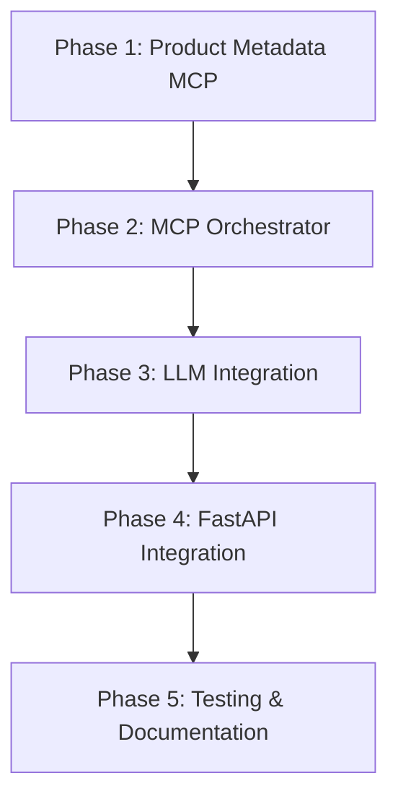

# Multi-MCP Support Implementation Plan

## Overview
Enable intelligent query routing across multiple specialized MCP servers to expand system capabilities beyond single database queries.

## Phase Dependencies

## System Integration Points

| Phase | Input | Output | Integration Target |
|-------|-------|--------|-------------------|
| Phase 1 | JSON metadata file | MCP resource endpoints | Standalone server on port 8002 |
| Phase 2 | YAML config file | Multi-MCP connections | Orchestrates all MCP servers |
| Phase 3 | All MCP resources | SQL with metadata context | LLM prompt enhancement |
| Phase 4 | User queries | Orchestrated responses | FastAPI chat endpoint |
| Phase 5 | Full system | Test coverage & docs | CI/CD pipeline |

## Success Metrics

- **Phase 1**: Product metadata accessible via MCP protocol
- **Phase 2**: Multiple MCPs connected and coordinated
- **Phase 3**: LLM generates SQL using metadata from all MCPs
- **Phase 4**: End-to-end query processing with multiple MCPs
- **Phase 5**: 80% test coverage, all E2E tests passing