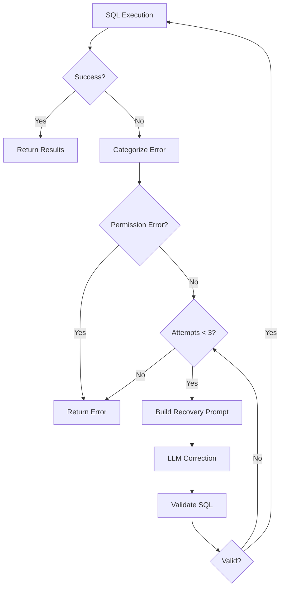

# Phase 2: Intelligence Layer - LLM Integration with SQL Recovery

## Phase Overview

### Objective
Implement intelligent query processing with LLM-based SQL generation that leverages multi-MCP resources for entity resolution and includes robust SQL error recovery mechanisms with retry logic.

### Scope
This phase focuses on:
- Enhanced LLM SQL generator with full metadata awareness
- Comprehensive prompt builder that incorporates all MCP resources
- SQL error categorization and recovery strategies
- Response parsing with validation
- Retry logic with exponential backoff
- Mock LLM responses for deterministic testing

This phase does NOT include:
- FastAPI endpoint modifications
- Frontend changes
- New MCP server implementations
- Performance optimizations beyond basic caching

### Prerequisites
- Phase 1 completed successfully
- MCP Orchestrator operational
- Product Metadata MCP server running
- Database MCP server running
- OpenRouter API key or Google Gemini API key configured
- Understanding of LLM prompt engineering

### Success Criteria
- [ ] LLM generates SQL using product metadata for entity resolution
- [ ] SQL errors are automatically categorized and recovered
- [ ] Retry logic handles transient failures (max 3 attempts)
- [ ] Response parser validates LLM output structure
- [ ] All unit tests pass with >85% coverage
- [ ] Integration tests validate LLM interactions
- [ ] Mock LLM responses enable deterministic testing
- [ ] Documentation covers prompt engineering and error recovery

## Architectural Guidance

### Design Patterns

#### 1. Strategy Pattern for Error Recovery
```python
from abc import ABC, abstractmethod

class ErrorRecoveryStrategy(ABC):
    """Base class for SQL error recovery strategies"""
    
    @abstractmethod
    async def recover(
        self,
        error: Exception,
        failed_sql: str,
        user_query: str,
        resources: Dict[str, Any],
        llm_client: Any
    ) -> str:
        """Attempt to recover from SQL error"""
        pass

class SyntaxErrorStrategy(ErrorRecoveryStrategy):
    """Recovery strategy for SQL syntax errors"""
    
    async def recover(self, error, failed_sql, user_query, resources, llm_client):
        # Build prompt focusing on syntax correction
        prompt = self._build_syntax_correction_prompt(
            error, failed_sql, user_query, resources
        )
        return await llm_client.generate(prompt)

class SchemaErrorStrategy(ErrorRecoveryStrategy):
    """Recovery strategy for schema-related errors"""
    
    async def recover(self, error, failed_sql, user_query, resources, llm_client):
        # Build prompt with full schema information
        prompt = self._build_schema_correction_prompt(
            error, failed_sql, user_query, resources
        )
        return await llm_client.generate(prompt)
```

#### 2. Builder Pattern for Prompts
```python
class PromptBuilder:
    """Builds comprehensive prompts for LLM SQL generation"""
    
    def __init__(self):
        self._sections = []
    
    def add_user_query(self, query: str) -> 'PromptBuilder':
        self._sections.append(f"USER QUERY: {query}")
        return self
    
    def add_resources(self, resources: Dict[str, Any]) -> 'PromptBuilder':
        self._sections.append(f"AVAILABLE RESOURCES:\n{json.dumps(resources, indent=2)}")
        return self
    
    def add_error_context(self, error: str, failed_sql: str) -> 'PromptBuilder':
        self._sections.append(f"PREVIOUS ERROR:\n{error}\nFAILED SQL:\n{failed_sql}")
        return self
    
    def add_instructions(self, instructions: str) -> 'PromptBuilder':
        self._sections.append(f"INSTRUCTIONS:\n{instructions}")
        return self
    
    def build(self) -> str:
        return "\n\n".join(self._sections)
```

#### 3. Chain of Responsibility for Response Parsing
```python
class ResponseParser:
    """Chain of parsers for LLM responses"""
    
    def __init__(self):
        self._parsers = [
            JsonResponseParser(),
            MarkdownResponseParser(),
            PlainTextResponseParser()
        ]
    
    def parse(self, response: str) -> Dict[str, Any]:
        for parser in self._parsers:
            try:
                result = parser.parse(response)
                if result:
                    return result
            except Exception:
                continue
        
        raise ValueError("Could not parse LLM response")
```

### Code Structure

#### Module Organization
```
fastapi_server/
├── llm_sql_generator.py       # Main SQL generation with metadata
├── prompt_builder.py          # Comprehensive prompt construction
├── response_parser.py         # Parse and validate LLM responses
├── sql_error_recovery.py      # SQL failure recovery logic
├── error_categorizer.py       # Categorize SQL errors
└── mock_llm_client.py        # Mock LLM for testing
```

### Data Models

#### SQL Generation Models
```python
from pydantic import BaseModel, Field
from typing import Dict, List, Optional, Any
from enum import Enum

class ErrorCategory(str, Enum):
    """Categories of SQL errors"""
    SYNTAX_ERROR = "syntax_error"
    MISSING_COLUMN = "missing_column"
    MISSING_TABLE = "missing_table"
    DATA_TYPE_MISMATCH = "data_type_mismatch"
    AMBIGUOUS_COLUMN = "ambiguous_column"
    AGGREGATION_ERROR = "aggregation_error"
    PERMISSION_ERROR = "permission_error"
    UNKNOWN_ERROR = "unknown_error"

class SQLGenerationRequest(BaseModel):
    """Request for SQL generation"""
    user_query: str = Field(..., description="Natural language query")
    resources: Dict[str, Any] = Field(..., description="All MCP resources")
    context: Optional[Dict[str, Any]] = Field(None, description="Additional context")
    max_tokens: int = Field(2000, description="Max tokens for response")

class ResolvedEntity(BaseModel):
    """An entity resolved from user query"""
    original_term: str = Field(..., description="Term from user query")
    resolved_value: str = Field(..., description="Resolved SQL value")
    source: str = Field(..., description="Source MCP server")
    confidence: float = Field(..., ge=0, le=1, description="Resolution confidence")

class SQLGenerationResponse(BaseModel):
    """Response from SQL generation"""
    sql_query: str = Field(..., description="Generated SQL query")
    resolved_entities: List[ResolvedEntity] = Field(
        default_factory=list,
        description="Entities resolved during generation"
    )
    explanation: str = Field("", description="Explanation of SQL generation")
    confidence: float = Field(0.0, ge=0, le=1, description="Overall confidence")
    metadata: Dict[str, Any] = Field(default_factory=dict)

class SQLErrorContext(BaseModel):
    """Context for SQL error recovery"""
    error_category: ErrorCategory
    error_message: str
    failed_sql: str
    user_query: str
    resources: Dict[str, Any]
    attempt_number: int = Field(1, ge=1, le=3)
    previous_attempts: List[str] = Field(default_factory=list)
```

#### Prompt Templates
```python
class PromptTemplates:
    """Templates for different prompt scenarios"""
    
    INITIAL_SQL_GENERATION = """
You are a SQL expert assistant with access to multiple data sources.

USER QUERY: {user_query}

AVAILABLE RESOURCES:
{resources}

INSTRUCTIONS:
1. Analyze the user query to identify entities and operations
2. Use the product aliases to resolve product names
3. Use column mappings for user-friendly terms
4. Generate a valid SQL SELECT query
5. Explain your entity resolution steps

RESPONSE FORMAT:
{{
    "sql_query": "SELECT ...",
    "resolved_entities": [
        {{
            "original_term": "abracadabra",
            "resolved_value": "123",
            "source": "Product Metadata MCP",
            "confidence": 0.95
        }}
    ],
    "explanation": "..."
}}
"""

    SQL_ERROR_RECOVERY = """
Previous SQL execution failed. Please correct the SQL based on the error.

ORIGINAL USER QUERY: {user_query}

FAILED SQL:
{failed_sql}

ERROR MESSAGE:
{error_message}

ERROR CATEGORY: {error_category}

AVAILABLE SCHEMA AND RESOURCES:
{resources}

SPECIFIC INSTRUCTIONS FOR {error_category}:
{specific_instructions}

Please generate a corrected SQL query that:
1. Addresses the specific error
2. Maintains the original query intent
3. Uses correct table and column names from the schema
4. Includes proper SQL syntax

RESPONSE FORMAT:
{{
    "sql_query": "SELECT ...",
    "explanation": "The error was caused by... I corrected it by...",
    "changes_made": ["change 1", "change 2"]
}}
"""

    ERROR_SPECIFIC_INSTRUCTIONS = {
        ErrorCategory.SYNTAX_ERROR: """
- Fix SQL syntax errors
- Ensure proper keyword usage
- Check for missing commas, parentheses, or quotes
- Verify clause order (SELECT, FROM, WHERE, GROUP BY, ORDER BY)
""",
        ErrorCategory.MISSING_COLUMN: """
- Use only columns that exist in the schema
- Check column names for typos
- Verify table aliases are used correctly
- Use fully qualified column names if ambiguous
""",
        ErrorCategory.MISSING_TABLE: """
- Use only tables that exist in the database
- Check table names for typos
- Verify the correct database/schema is being used
- Use the exact table names from the schema
""",
        ErrorCategory.DATA_TYPE_MISMATCH: """
- Add appropriate type casting (CAST, ::type)
- Use correct comparison operators for data types
- Format date/time values correctly
- Handle NULL values appropriately
""",
        ErrorCategory.AGGREGATION_ERROR: """
- Include all non-aggregated columns in GROUP BY
- Use aggregate functions correctly
- Handle HAVING vs WHERE clauses properly
- Check for invalid aggregation combinations
"""
    }
```

### API Contracts

#### LLM SQL Generator Interface
```python
class LLMSQLGenerator:
    """Interface for LLM-based SQL generation"""
    
    async def generate_sql(
        self,
        request: SQLGenerationRequest
    ) -> SQLGenerationResponse:
        """Generate SQL from natural language query"""
        
    async def recover_from_error(
        self,
        context: SQLErrorContext
    ) -> SQLGenerationResponse:
        """Attempt to recover from SQL execution error"""
```

#### Error Categorizer Interface
```python
class ErrorCategorizer:
    """Categorizes SQL execution errors"""
    
    def categorize(self, error_message: str) -> ErrorCategory:
        """Determine error category from message"""
```

### Technology Stack
- **LangChain**: LLM orchestration framework
- **OpenRouter/Gemini**: LLM providers
- **Jinja2**: Template rendering for prompts
- **jsonschema**: Response validation
- **tenacity**: Retry logic with exponential backoff

## Detailed Implementation Tasks

### Task 1: Implement Error Categorization

#### Step 1.1: Create error categorizer
- [ ] Create `error_categorizer.py`
- [ ] Implement pattern matching for error types
- [ ] Add confidence scoring
- [ ] Handle edge cases

```python
# fastapi_server/error_categorizer.py
import re
from typing import Tuple
from enum import Enum

class ErrorCategory(str, Enum):
    SYNTAX_ERROR = "syntax_error"
    MISSING_COLUMN = "missing_column"
    MISSING_TABLE = "missing_table"
    DATA_TYPE_MISMATCH = "data_type_mismatch"
    AMBIGUOUS_COLUMN = "ambiguous_column"
    AGGREGATION_ERROR = "aggregation_error"
    PERMISSION_ERROR = "permission_error"
    UNKNOWN_ERROR = "unknown_error"

class ErrorCategorizer:
    """Categorizes SQL execution errors"""
    
    # Error patterns mapped to categories
    ERROR_PATTERNS = {
        ErrorCategory.SYNTAX_ERROR: [
            r"syntax error",
            r"unexpected token",
            r"invalid syntax",
            r"parse error",
            r"expected .* but got",
        ],
        ErrorCategory.MISSING_COLUMN: [
            r"column .* does not exist",
            r"no such column",
            r"unknown column",
            r"field .* not found",
            r"invalid column name",
        ],
        ErrorCategory.MISSING_TABLE: [
            r"table .* does not exist",
            r"no such table",
            r"relation .* does not exist",
            r"unknown table",
            r"from clause entry .* not found",
        ],
        ErrorCategory.DATA_TYPE_MISMATCH: [
            r"type mismatch",
            r"cannot cast",
            r"invalid input syntax for type",
            r"operator does not exist",
            r"incompatible types",
        ],
        ErrorCategory.AMBIGUOUS_COLUMN: [
            r"column reference .* is ambiguous",
            r"ambiguous column",
            r"column .* must appear in the GROUP BY",
        ],
        ErrorCategory.AGGREGATION_ERROR: [
            r"must appear in the GROUP BY clause",
            r"aggregate function calls cannot be nested",
            r"aggregate functions are not allowed",
            r"column .* must appear in GROUP BY",
        ],
        ErrorCategory.PERMISSION_ERROR: [
            r"permission denied",
            r"access denied",
            r"insufficient privileges",
            r"not authorized",
        ]
    }
    
    def categorize(self, error_message: str) -> Tuple[ErrorCategory, float]:
        """
        Categorize an error message
        
        Returns:
            Tuple of (category, confidence)
        """
        error_lower = error_message.lower()
        
        for category, patterns in self.ERROR_PATTERNS.items():
            for pattern in patterns:
                if re.search(pattern, error_lower):
                    # High confidence if pattern matches
                    return category, 0.9
        
        # Check for common keywords with lower confidence
        if "column" in error_lower:
            return ErrorCategory.MISSING_COLUMN, 0.6
        elif "table" in error_lower or "relation" in error_lower:
            return ErrorCategory.MISSING_TABLE, 0.6
        elif "syntax" in error_lower or "parse" in error_lower:
            return ErrorCategory.SYNTAX_ERROR, 0.6
        elif "type" in error_lower or "cast" in error_lower:
            return ErrorCategory.DATA_TYPE_MISMATCH, 0.6
        elif "group" in error_lower or "aggregate" in error_lower:
            return ErrorCategory.AGGREGATION_ERROR, 0.6
        
        return ErrorCategory.UNKNOWN_ERROR, 0.3
    
    def get_recovery_instructions(self, category: ErrorCategory) -> str:
        """Get specific recovery instructions for an error category"""
        instructions = {
            ErrorCategory.SYNTAX_ERROR: "Fix SQL syntax, check keywords and punctuation",
            ErrorCategory.MISSING_COLUMN: "Use correct column names from schema",
            ErrorCategory.MISSING_TABLE: "Use correct table names from schema",
            ErrorCategory.DATA_TYPE_MISMATCH: "Add proper type casting",
            ErrorCategory.AMBIGUOUS_COLUMN: "Use table prefixes for columns",
            ErrorCategory.AGGREGATION_ERROR: "Fix GROUP BY clause",
            ErrorCategory.PERMISSION_ERROR: "Cannot recover - insufficient permissions",
            ErrorCategory.UNKNOWN_ERROR: "Review entire query for issues"
        }
        return instructions.get(category, "General SQL correction needed")
```

### Task 2: Implement Prompt Builder

#### Step 2.1: Create comprehensive prompt builder
- [ ] Create `prompt_builder.py`
- [ ] Implement modular prompt construction
- [ ] Add resource formatting
- [ ] Include error context handling

```python
# fastapi_server/prompt_builder.py
import json
from typing import Dict, Any, List, Optional
from datetime import datetime

class PromptBuilder:
    """Builds comprehensive prompts for LLM SQL generation"""
    
    def __init__(self):
        self._sections = []
        self._metadata = {}
    
    def add_header(self, title: str) -> 'PromptBuilder':
        """Add a header section"""
        self._sections.append(f"=== {title.upper()} ===")
        return self
    
    def add_user_query(self, query: str) -> 'PromptBuilder':
        """Add the user's natural language query"""
        self._sections.append(f"USER QUERY:\n{query}")
        return self
    
    def add_mcp_resources(self, resources: Dict[str, Any]) -> 'PromptBuilder':
        """Add formatted MCP resources"""
        formatted = self._format_resources(resources)
        self._sections.append(f"AVAILABLE RESOURCES:\n{formatted}")
        return self
    
    def add_error_context(
        self,
        error_message: str,
        failed_sql: str,
        error_category: str
    ) -> 'PromptBuilder':
        """Add error context for recovery"""
        context = f"""PREVIOUS ATTEMPT FAILED:
Error Category: {error_category}
Error Message: {error_message}

Failed SQL:
{failed_sql}
"""
        self._sections.append(context)
        return self
    
    def add_instructions(self, instructions: List[str]) -> 'PromptBuilder':
        """Add numbered instructions"""
        formatted_instructions = "\n".join(
            f"{i+1}. {instruction}"
            for i, instruction in enumerate(instructions)
        )
        self._sections.append(f"INSTRUCTIONS:\n{formatted_instructions}")
        return self
    
    def add_response_format(self, format_example: Dict[str, Any]) -> 'PromptBuilder':
        """Add expected response format"""
        formatted = json.dumps(format_example, indent=2)
        self._sections.append(f"EXPECTED RESPONSE FORMAT:\n{formatted}")
        return self
    
    def add_examples(self, examples: List[Dict[str, str]]) -> 'PromptBuilder':
        """Add example query/SQL pairs"""
        if not examples:
            return self
        
        examples_text = "EXAMPLES:\n"
        for i, example in enumerate(examples, 1):
            examples_text += f"\nExample {i}:\n"
            examples_text += f"Query: {example['query']}\n"
            examples_text += f"SQL: {example['sql']}\n"
        
        self._sections.append(examples_text)
        return self
    
    def _format_resources(self, resources: Dict[str, Any]) -> str:
        """Format MCP resources for readability"""
        formatted_parts = []
        
        for server_name, server_data in resources.items():
            part = f"\n--- {server_name} (Priority: {server_data.get('priority', 'N/A')}) ---"
            part += f"\nDomains: {', '.join(server_data.get('domains', []))}"
            part += f"\nCapabilities: {', '.join(server_data.get('capabilities', []))}"
            
            # Format resources
            if 'resources' in server_data:
                part += "\nResources:"
                for resource_name, resource_data in server_data['resources'].items():
                    # Truncate large resources
                    if isinstance(resource_data, dict):
                        truncated = self._truncate_dict(resource_data, max_items=5)
                        part += f"\n  - {resource_name}: {json.dumps(truncated, indent=4)}"
                    else:
                        part += f"\n  - {resource_name}: {resource_data}"
            
            formatted_parts.append(part)
        
        return "\n".join(formatted_parts)
    
    def _truncate_dict(self, d: Dict, max_items: int = 5) -> Dict:
        """Truncate dictionary for display"""
        if len(d) <= max_items:
            return d
        
        items = list(d.items())[:max_items]
        truncated = dict(items)
        truncated["..."] = f"({len(d) - max_items} more items)"
        return truncated
    
    def build(self) -> str:
        """Build the final prompt"""
        # Add timestamp
        timestamp = datetime.utcnow().isoformat()
        prompt = f"[Generated at {timestamp}]\n\n"
        
        # Join all sections
        prompt += "\n\n".join(self._sections)
        
        return prompt
    
    def build_initial_generation_prompt(
        self,
        user_query: str,
        resources: Dict[str, Any]
    ) -> str:
        """Build prompt for initial SQL generation"""
        return (
            self.add_header("SQL Generation Task")
            .add_user_query(user_query)
            .add_mcp_resources(resources)
            .add_instructions([
                "Analyze the user query to identify entities and operations",
                "Use product aliases from Product Metadata MCP to resolve product names",
                "Use column mappings to translate user-friendly terms",
                "Generate a valid SQL SELECT query",
                "Include entity resolution steps in your explanation"
            ])
            .add_response_format({
                "sql_query": "SELECT ...",
                "resolved_entities": [
                    {
                        "original_term": "term from query",
                        "resolved_value": "SQL value",
                        "source": "MCP server name",
                        "confidence": 0.95
                    }
                ],
                "explanation": "Step-by-step explanation"
            })
            .build()
        )
    
    def build_error_recovery_prompt(
        self,
        user_query: str,
        resources: Dict[str, Any],
        error_context: Dict[str, Any]
    ) -> str:
        """Build prompt for SQL error recovery"""
        category_instructions = {
            "syntax_error": [
                "Fix SQL syntax errors",
                "Check for missing keywords or punctuation",
                "Ensure proper clause order"
            ],
            "missing_column": [
                "Use only columns that exist in the schema",
                "Check for typos in column names",
                "Use fully qualified names if needed"
            ],
            "missing_table": [
                "Use only tables from the available schema",
                "Check for typos in table names",
                "Verify database/schema references"
            ]
        }
        
        instructions = category_instructions.get(
            error_context['error_category'],
            ["Analyze and fix the SQL error"]
        )
        instructions.extend([
            "Maintain the original query intent",
            "Explain what was wrong and how you fixed it"
        ])
        
        return (
            self.add_header("SQL Error Recovery")
            .add_user_query(user_query)
            .add_error_context(
                error_context['error_message'],
                error_context['failed_sql'],
                error_context['error_category']
            )
            .add_mcp_resources(resources)
            .add_instructions(instructions)
            .add_response_format({
                "sql_query": "SELECT ... (corrected)",
                "explanation": "What was wrong and how it was fixed",
                "changes_made": ["specific change 1", "specific change 2"]
            })
            .build()
        )
```

### Task 3: Implement Response Parser

#### Step 3.1: Create response parser with validation
- [ ] Create `response_parser.py`
- [ ] Implement multiple parsing strategies
- [ ] Add response validation
- [ ] Handle malformed responses

```python
# fastapi_server/response_parser.py
import json
import re
from typing import Dict, Any, Optional, List
from pydantic import BaseModel, ValidationError
import logging

logger = logging.getLogger(__name__)

class ParsedResponse(BaseModel):
    """Validated parsed response"""
    sql_query: str
    resolved_entities: List[Dict[str, Any]] = []
    explanation: str = ""
    confidence: float = 0.0
    changes_made: List[str] = []
    raw_response: str = ""

class ResponseParser:
    """Parses and validates LLM responses"""
    
    def __init__(self):
        self._parsers = [
            self._parse_json,
            self._parse_markdown_json,
            self._parse_structured_text,
            self._parse_sql_only
        ]
    
    def parse(self, response: str) -> ParsedResponse:
        """
        Parse LLM response using multiple strategies
        
        Returns:
            ParsedResponse object
        
        Raises:
            ValueError if parsing fails
        """
        # Try each parser in order
        for parser_func in self._parsers:
            try:
                result = parser_func(response)
                if result:
                    result['raw_response'] = response
                    return ParsedResponse(**result)
            except Exception as e:
                logger.debug(f"Parser {parser_func.__name__} failed: {e}")
                continue
        
        # If all parsers fail, raise error
        raise ValueError(f"Could not parse LLM response: {response[:200]}...")
    
    def _parse_json(self, response: str) -> Optional[Dict[str, Any]]:
        """Parse pure JSON response"""
        try:
            # Try to parse as JSON directly
            data = json.loads(response)
            
            # Validate required fields
            if 'sql_query' not in data:
                return None
            
            return data
        except json.JSONDecodeError:
            return None
    
    def _parse_markdown_json(self, response: str) -> Optional[Dict[str, Any]]:
        """Parse JSON embedded in markdown code blocks"""
        # Look for ```json blocks
        json_pattern = r'```(?:json)?\s*\n(.*?)\n```'
        matches = re.findall(json_pattern, response, re.DOTALL)
        
        for match in matches:
            try:
                data = json.loads(match)
                if 'sql_query' in data:
                    return data
            except json.JSONDecodeError:
                continue
        
        return None
    
    def _parse_structured_text(self, response: str) -> Optional[Dict[str, Any]]:
        """Parse structured text response"""
        result = {}
        
        # Extract SQL query
        sql_patterns = [
            r'SQL[:\s]+```sql\s*\n(.*?)\n```',
            r'SQL Query[:\s]*\n(.*?)(?:\n\n|$)',
            r'```sql\s*\n(.*?)\n```',
            r'SELECT\s+.*?(?:;|$)'
        ]
        
        for pattern in sql_patterns:
            match = re.search(pattern, response, re.DOTALL | re.IGNORECASE)
            if match:
                result['sql_query'] = match.group(1).strip()
                break
        
        if 'sql_query' not in result:
            return None
        
        # Extract explanation
        explanation_patterns = [
            r'Explanation[:\s]*\n(.*?)(?:\n\n|$)',
            r'Reasoning[:\s]*\n(.*?)(?:\n\n|$)',
            r'Steps[:\s]*\n(.*?)(?:\n\n|$)'
        ]
        
        for pattern in explanation_patterns:
            match = re.search(pattern, response, re.DOTALL | re.IGNORECASE)
            if match:
                result['explanation'] = match.group(1).strip()
                break
        
        # Extract resolved entities if present
        entities_pattern = r'Resolved Entities[:\s]*\n(.*?)(?:\n\n|$)'
        match = re.search(entities_pattern, response, re.DOTALL | re.IGNORECASE)
        if match:
            # Try to parse as JSON list
            try:
                entities_text = match.group(1).strip()
                if entities_text.startswith('['):
                    result['resolved_entities'] = json.loads(entities_text)
            except:
                pass
        
        return result
    
    def _parse_sql_only(self, response: str) -> Optional[Dict[str, Any]]:
        """Last resort: extract SQL query only"""
        # Look for SELECT statement
        sql_match = re.search(
            r'(SELECT\s+.*?)(?:;|$)',
            response,
            re.DOTALL | re.IGNORECASE
        )
        
        if sql_match:
            return {
                'sql_query': sql_match.group(1).strip(),
                'explanation': 'SQL extracted from response',
                'confidence': 0.5
            }
        
        return None
    
    def validate_sql(self, sql: str) -> bool:
        """Basic SQL validation"""
        # Check for required keywords
        sql_upper = sql.upper()
        
        # Must have SELECT
        if 'SELECT' not in sql_upper:
            return False
        
        # Must have FROM
        if 'FROM' not in sql_upper:
            return False
        
        # Check for dangerous operations (should be SELECT only)
        dangerous_keywords = ['DROP', 'DELETE', 'INSERT', 'UPDATE', 'ALTER', 'CREATE']
        for keyword in dangerous_keywords:
            if keyword in sql_upper:
                logger.warning(f"Dangerous keyword '{keyword}' found in SQL")
                return False
        
        # Check for basic syntax
        if sql.count('(') != sql.count(')'):
            return False
        
        return True
    
    def extract_confidence(self, response: str) -> float:
        """Extract confidence score from response"""
        # Look for confidence mentions
        confidence_pattern = r'confidence[:\s]*([0-9.]+)'
        match = re.search(confidence_pattern, response, re.IGNORECASE)
        
        if match:
            try:
                confidence = float(match.group(1))
                return min(max(confidence, 0.0), 1.0)  # Clamp to [0, 1]
            except ValueError:
                pass
        
        # Default confidence based on response quality
        if 'high confidence' in response.lower():
            return 0.9
        elif 'medium confidence' in response.lower():
            return 0.7
        elif 'low confidence' in response.lower():
            return 0.5
        
        return 0.75  # Default
```

### Task 4: Implement SQL Error Recovery

#### Step 4.1: Create SQL error recovery system
- [ ] Create `sql_error_recovery.py`
- [ ] Implement retry logic
- [ ] Add validation before retry
- [ ] Track recovery attempts

```python
# fastapi_server/sql_error_recovery.py
import logging
from typing import Dict, Any, List, Optional
from dataclasses import dataclass
from datetime import datetime
import asyncio

from .error_categorizer import ErrorCategorizer, ErrorCategory
from .prompt_builder import PromptBuilder
from .response_parser import ResponseParser, ParsedResponse

logger = logging.getLogger(__name__)

@dataclass
class RecoveryAttempt:
    """Record of a recovery attempt"""
    attempt_number: int
    error_category: ErrorCategory
    original_sql: str
    corrected_sql: str
    success: bool
    error_message: Optional[str]
    timestamp: datetime

class SQLErrorRecovery:
    """Handles SQL error recovery with retry logic"""
    
    MAX_RETRY_ATTEMPTS = 3
    
    def __init__(
        self,
        llm_client: Any,
        error_categorizer: Optional[ErrorCategorizer] = None,
        prompt_builder: Optional[PromptBuilder] = None,
        response_parser: Optional[ResponseParser] = None
    ):
        self.llm_client = llm_client
        self.error_categorizer = error_categorizer or ErrorCategorizer()
        self.prompt_builder = prompt_builder or PromptBuilder()
        self.response_parser = response_parser or ResponseParser()
        self.recovery_history: List[RecoveryAttempt] = []
    
    async def recover_from_error(
        self,
        error_message: str,
        failed_sql: str,
        user_query: str,
        resources: Dict[str, Any],
        attempt_number: int = 1
    ) -> Optional[ParsedResponse]:
        """
        Attempt to recover from SQL execution error
        
        Returns:
            ParsedResponse with corrected SQL, or None if recovery fails
        """
        # Check if we've exceeded max attempts
        if attempt_number > self.MAX_RETRY_ATTEMPTS:
            logger.error(f"Max recovery attempts ({self.MAX_RETRY_ATTEMPTS}) exceeded")
            return None
        
        # Categorize the error
        error_category, confidence = self.error_categorizer.categorize(error_message)
        logger.info(f"Error categorized as {error_category} with confidence {confidence}")
        
        # Don't retry permission errors
        if error_category == ErrorCategory.PERMISSION_ERROR:
            logger.error("Permission error cannot be recovered automatically")
            return None
        
        # Build recovery prompt
        prompt = self._build_recovery_prompt(
            user_query=user_query,
            resources=resources,
            error_message=error_message,
            failed_sql=failed_sql,
            error_category=error_category,
            attempt_number=attempt_number
        )
        
        try:
            # Call LLM for correction
            logger.info(f"Requesting SQL correction (attempt {attempt_number})")
            llm_response = await self.llm_client.generate(prompt)
            
            # Parse response
            parsed = self.response_parser.parse(llm_response)
            
            # Validate the corrected SQL
            if not self._validate_corrected_sql(
                parsed.sql_query,
                resources,
                error_category
            ):
                logger.warning("Corrected SQL failed validation")
                
                # Try again if we have attempts left
                if attempt_number < self.MAX_RETRY_ATTEMPTS:
                    return await self.recover_from_error(
                        error_message="Validation failed: " + error_message,
                        failed_sql=failed_sql,
                        user_query=user_query,
                        resources=resources,
                        attempt_number=attempt_number + 1
                    )
                return None
            
            # Record successful recovery
            self.recovery_history.append(RecoveryAttempt(
                attempt_number=attempt_number,
                error_category=error_category,
                original_sql=failed_sql,
                corrected_sql=parsed.sql_query,
                success=True,
                error_message=None,
                timestamp=datetime.utcnow()
            ))
            
            logger.info(f"SQL successfully corrected on attempt {attempt_number}")
            return parsed
            
        except Exception as e:
            logger.error(f"Recovery attempt {attempt_number} failed: {e}")
            
            # Record failed recovery
            self.recovery_history.append(RecoveryAttempt(
                attempt_number=attempt_number,
                error_category=error_category,
                original_sql=failed_sql,
                corrected_sql="",
                success=False,
                error_message=str(e),
                timestamp=datetime.utcnow()
            ))
            
            # Try again if we have attempts left
            if attempt_number < self.MAX_RETRY_ATTEMPTS:
                await asyncio.sleep(1)  # Brief delay before retry
                return await self.recover_from_error(
                    error_message=error_message,
                    failed_sql=failed_sql,
                    user_query=user_query,
                    resources=resources,
                    attempt_number=attempt_number + 1
                )
            
            return None
    
    def _build_recovery_prompt(
        self,
        user_query: str,
        resources: Dict[str, Any],
        error_message: str,
        failed_sql: str,
        error_category: ErrorCategory,
        attempt_number: int
    ) -> str:
        """Build prompt for error recovery"""
        
        # Get category-specific instructions
        instructions = self._get_category_instructions(error_category)
        
        # Add attempt context if not first attempt
        if attempt_number > 1:
            instructions.append(
                f"This is attempt {attempt_number}. Previous attempts failed. "
                "Be more careful and thorough in your correction."
            )
        
        # Extract schema information from resources
        schema_info = self._extract_schema_info(resources)
        
        prompt = self.prompt_builder.build_error_recovery_prompt(
            user_query=user_query,
            resources=resources,
            error_context={
                'error_message': error_message,
                'failed_sql': failed_sql,
                'error_category': error_category.value,
                'schema_info': schema_info
            }
        )
        
        return prompt
    
    def _get_category_instructions(self, category: ErrorCategory) -> List[str]:
        """Get specific instructions for error category"""
        instructions_map = {
            ErrorCategory.SYNTAX_ERROR: [
                "Fix SQL syntax errors",
                "Check for missing or extra commas",
                "Verify parentheses are balanced",
                "Ensure keywords are spelled correctly"
            ],
            ErrorCategory.MISSING_COLUMN: [
                "Use only columns that exist in the schema",
                "Check column names for typos",
                "Use table prefixes for ambiguous columns",
                "Verify column exists in the selected table"
            ],
            ErrorCategory.MISSING_TABLE: [
                "Use only tables that exist in the database",
                "Check table names for typos",
                "Verify you're using the correct schema/database",
                "Use exact table names from the schema"
            ],
            ErrorCategory.DATA_TYPE_MISMATCH: [
                "Add appropriate type casting (CAST or ::)",
                "Use correct format for date/time values",
                "Handle NULL values appropriately",
                "Use compatible operators for data types"
            ],
            ErrorCategory.AGGREGATION_ERROR: [
                "Include all non-aggregated columns in GROUP BY",
                "Use aggregate functions correctly",
                "Separate WHERE and HAVING clauses properly",
                "Don't nest aggregate functions"
            ],
            ErrorCategory.AMBIGUOUS_COLUMN: [
                "Use table aliases or prefixes for columns",
                "Specify which table each column comes from",
                "Use fully qualified column names"
            ]
        }
        
        return instructions_map.get(category, [
            "Analyze the error carefully",
            "Make necessary corrections to fix the issue"
        ])
    
    def _extract_schema_info(self, resources: Dict[str, Any]) -> Dict[str, Any]:
        """Extract schema information from resources"""
        schema_info = {
            'tables': [],
            'columns': {},
            'relationships': []
        }
        
        # Look for database schema in resources
        for server_name, server_data in resources.items():
            if 'database' in server_data.get('domains', []):
                # Extract table and column information
                if 'resources' in server_data:
                    for resource_name, resource_data in server_data['resources'].items():
                        if 'tables' in str(resource_name).lower():
                            # Process table schema
                            if isinstance(resource_data, dict):
                                for table_name, table_info in resource_data.items():
                                    if isinstance(table_info, dict):
                                        schema_info['tables'].append(table_name)
                                        if 'columns' in table_info:
                                            schema_info['columns'][table_name] = table_info['columns']
        
        return schema_info
    
    def _validate_corrected_sql(
        self,
        sql: str,
        resources: Dict[str, Any],
        error_category: ErrorCategory
    ) -> bool:
        """Validate corrected SQL before execution"""
        
        # Basic SQL validation
        if not self.response_parser.validate_sql(sql):
            return False
        
        # Category-specific validation
        if error_category == ErrorCategory.MISSING_TABLE:
            # Check that tables exist in schema
            schema_info = self._extract_schema_info(resources)
            tables_in_sql = self._extract_tables_from_sql(sql)
            
            for table in tables_in_sql:
                if table.lower() not in [t.lower() for t in schema_info['tables']]:
                    logger.warning(f"Table '{table}' not found in schema")
                    return False
        
        elif error_category == ErrorCategory.MISSING_COLUMN:
            # Check that columns exist in schema
            schema_info = self._extract_schema_info(resources)
            # This is a simplified check - in production, use SQL parser
            for table_name, columns in schema_info['columns'].items():
                # Basic validation - could be improved with proper SQL parsing
                pass
        
        return True
    
    def _extract_tables_from_sql(self, sql: str) -> List[str]:
        """Extract table names from SQL (simplified)"""
        import re
        
        # Simple regex to find table names after FROM and JOIN
        tables = []
        
        # Find FROM clause
        from_match = re.search(r'FROM\s+(\w+)', sql, re.IGNORECASE)
        if from_match:
            tables.append(from_match.group(1))
        
        # Find JOIN clauses
        join_matches = re.findall(r'JOIN\s+(\w+)', sql, re.IGNORECASE)
        tables.extend(join_matches)
        
        return tables
    
    def get_recovery_stats(self) -> Dict[str, Any]:
        """Get statistics about recovery attempts"""
        if not self.recovery_history:
            return {
                'total_attempts': 0,
                'successful_recoveries': 0,
                'failed_recoveries': 0,
                'success_rate': 0.0
            }
        
        successful = sum(1 for r in self.recovery_history if r.success)
        total = len(self.recovery_history)
        
        # Count by error category
        category_counts = {}
        for record in self.recovery_history:
            category = record.error_category.value
            if category not in category_counts:
                category_counts[category] = {'attempts': 0, 'successes': 0}
            category_counts[category]['attempts'] += 1
            if record.success:
                category_counts[category]['successes'] += 1
        
        return {
            'total_attempts': total,
            'successful_recoveries': successful,
            'failed_recoveries': total - successful,
            'success_rate': successful / total if total > 0 else 0.0,
            'by_category': category_counts,
            'average_attempts': sum(r.attempt_number for r in self.recovery_history) / total if total > 0 else 0
        }
```

### Task 5: Implement Main LLM SQL Generator

#### Step 5.1: Create enhanced SQL generator
- [ ] Create `llm_sql_generator.py`
- [ ] Integrate all components
- [ ] Add metadata awareness
- [ ] Implement complete flow

```python
# fastapi_server/llm_sql_generator.py
import logging
from typing import Dict, Any, Optional, List
from datetime import datetime
import asyncio

from .prompt_builder import PromptBuilder
from .response_parser import ResponseParser, ParsedResponse
from .sql_error_recovery import SQLErrorRecovery
from .error_categorizer import ErrorCategorizer

logger = logging.getLogger(__name__)

class LLMSQLGenerator:
    """Enhanced LLM-based SQL generator with metadata awareness"""
    
    def __init__(
        self,
        llm_client: Any,
        orchestrator: Any
    ):
        self.llm_client = llm_client
        self.orchestrator = orchestrator
        self.prompt_builder = PromptBuilder()
        self.response_parser = ResponseParser()
        self.error_recovery = SQLErrorRecovery(
            llm_client=llm_client,
            error_categorizer=ErrorCategorizer(),
            prompt_builder=self.prompt_builder,
            response_parser=self.response_parser
        )
        self._generation_history = []
    
    async def generate_sql(
        self,
        user_query: str,
        context: Optional[Dict[str, Any]] = None
    ) -> Dict[str, Any]:
        """
        Generate SQL from natural language query using MCP resources
        
        Returns:
            Dictionary with sql_query, resolved_entities, explanation, etc.
        """
        start_time = datetime.utcnow()
        
        try:
            # Gather resources from all MCP servers
            logger.info("Gathering resources from MCP servers")
            resources = await self.orchestrator.gather_all_resources()
            
            if not resources:
                raise ValueError("No MCP resources available")
            
            # Build comprehensive prompt
            prompt = self.prompt_builder.build_initial_generation_prompt(
                user_query=user_query,
                resources=resources
            )
            
            # Generate SQL using LLM
            logger.info("Generating SQL with LLM")
            llm_response = await self.llm_client.generate(prompt)
            
            # Parse and validate response
            parsed = self.response_parser.parse(llm_response)
            
            # Validate SQL
            if not self.response_parser.validate_sql(parsed.sql_query):
                raise ValueError(f"Generated SQL is invalid: {parsed.sql_query}")
            
            # Enhance with metadata
            enhanced = self._enhance_with_metadata(parsed, resources)
            
            # Record generation
            self._record_generation(
                user_query=user_query,
                sql_query=enhanced['sql_query'],
                success=True,
                duration=(datetime.utcnow() - start_time).total_seconds()
            )
            
            return enhanced
            
        except Exception as e:
            logger.error(f"SQL generation failed: {e}")
            
            # Record failure
            self._record_generation(
                user_query=user_query,
                sql_query=None,
                success=False,
                duration=(datetime.utcnow() - start_time).total_seconds(),
                error=str(e)
            )
            
            raise
    
    async def generate_sql_with_recovery(
        self,
        user_query: str,
        execute_func: Any,
        context: Optional[Dict[str, Any]] = None
    ) -> Dict[str, Any]:
        """
        Generate SQL with automatic error recovery
        
        Args:
            user_query: Natural language query
            execute_func: Function to execute SQL (for testing)
            context: Additional context
        
        Returns:
            Dictionary with final SQL and results
        """
        # Generate initial SQL
        generation_result = await self.generate_sql(user_query, context)
        sql_query = generation_result['sql_query']
        
        # Try to execute
        try:
            logger.info(f"Executing SQL: {sql_query}")
            result = await execute_func(sql_query)
            
            # Success - return with results
            generation_result['execution_result'] = result
            generation_result['recovery_needed'] = False
            return generation_result
            
        except Exception as e:
            logger.warning(f"SQL execution failed: {e}")
            
            # Attempt recovery
            resources = await self.orchestrator.gather_all_resources()
            
            recovery_result = await self.error_recovery.recover_from_error(
                error_message=str(e),
                failed_sql=sql_query,
                user_query=user_query,
                resources=resources
            )
            
            if recovery_result:
                # Try executing recovered SQL
                try:
                    result = await execute_func(recovery_result.sql_query)
                    
                    return {
                        'sql_query': recovery_result.sql_query,
                        'original_sql': sql_query,
                        'resolved_entities': recovery_result.resolved_entities,
                        'explanation': recovery_result.explanation,
                        'execution_result': result,
                        'recovery_needed': True,
                        'recovery_attempts': len(self.error_recovery.recovery_history),
                        'changes_made': recovery_result.changes_made
                    }
                    
                except Exception as e2:
                    logger.error(f"Recovered SQL also failed: {e2}")
                    raise
            else:
                logger.error("Recovery failed")
                raise
    
    def _enhance_with_metadata(
        self,
        parsed: ParsedResponse,
        resources: Dict[str, Any]
    ) -> Dict[str, Any]:
        """Enhance parsed response with metadata information"""
        
        # Extract product metadata if available
        product_metadata = None
        column_mappings = None
        
        for server_name, server_data in resources.items():
            if 'product' in ' '.join(server_data.get('domains', [])).lower():
                if 'resources' in server_data:
                    for resource_name, resource_data in server_data['resources'].items():
                        if 'aliases' in resource_name.lower():
                            product_metadata = resource_data
                        elif 'column' in resource_name.lower():
                            column_mappings = resource_data
        
        # Build enhanced response
        enhanced = {
            'sql_query': parsed.sql_query,
            'resolved_entities': parsed.resolved_entities,
            'explanation': parsed.explanation,
            'confidence': parsed.confidence,
            'metadata_used': {
                'product_metadata_available': product_metadata is not None,
                'column_mappings_available': column_mappings is not None,
                'total_resources': sum(
                    len(s.get('resources', {}))
                    for s in resources.values()
                ),
                'mcp_servers': list(resources.keys())
            },
            'generation_timestamp': datetime.utcnow().isoformat()
        }
        
        return enhanced
    
    def _record_generation(
        self,
        user_query: str,
        sql_query: Optional[str],
        success: bool,
        duration: float,
        error: Optional[str] = None
    ):
        """Record generation attempt for analysis"""
        record = {
            'timestamp': datetime.utcnow().isoformat(),
            'user_query': user_query,
            'sql_query': sql_query,
            'success': success,
            'duration_seconds': duration,
            'error': error
        }
        
        self._generation_history.append(record)
        
        # Keep only last 100 records
        if len(self._generation_history) > 100:
            self._generation_history = self._generation_history[-100:]
    
    def get_generation_stats(self) -> Dict[str, Any]:
        """Get statistics about SQL generation"""
        if not self._generation_history:
            return {
                'total_generations': 0,
                'successful': 0,
                'failed': 0,
                'success_rate': 0.0,
                'average_duration': 0.0
            }
        
        successful = sum(1 for r in self._generation_history if r['success'])
        total = len(self._generation_history)
        durations = [r['duration_seconds'] for r in self._generation_history]
        
        return {
            'total_generations': total,
            'successful': successful,
            'failed': total - successful,
            'success_rate': successful / total if total > 0 else 0.0,
            'average_duration': sum(durations) / len(durations) if durations else 0.0,
            'recovery_stats': self.error_recovery.get_recovery_stats()
        }
```

### Task 6: Create Mock LLM Client for Testing

#### Step 6.1: Implement mock LLM client
- [ ] Create `mock_llm_client.py`
- [ ] Add deterministic responses
- [ ] Support error scenarios
- [ ] Enable controlled testing

```python
# fastapi_server/mock_llm_client.py
import json
import asyncio
from typing import Dict, Any, List, Optional
import re

class MockLLMClient:
    """Mock LLM client for deterministic testing"""
    
    def __init__(self):
        self.responses = {}
        self.call_history = []
        self.response_delay = 0.1  # Simulate API delay
        self._setup_default_responses()
    
    def _setup_default_responses(self):
        """Set up default mock responses"""
        
        # Response for product query
        self.responses['abracadabra'] = {
            "sql_query": "SELECT SUM(s.total_amount) as total_sales FROM sales s JOIN products p ON s.product_id = p.product_id WHERE p.product_id = 123 AND DATE_TRUNC('month', s.sale_date) = DATE_TRUNC('month', CURRENT_DATE)",
            "resolved_entities": [
                {
                    "original_term": "abracadabra",
                    "resolved_value": "123",
                    "source": "Product Metadata MCP",
                    "confidence": 0.95
                },
                {
                    "original_term": "this month",
                    "resolved_value": "DATE_TRUNC('month', sale_date) = DATE_TRUNC('month', CURRENT_DATE)",
                    "source": "Product Metadata MCP",
                    "confidence": 0.90
                }
            ],
            "explanation": "I resolved 'abracadabra' to product_id 123 using the Product Metadata MCP aliases. 'This month' was translated to a date truncation expression for the current month."
        }
        
        # Response for syntax error recovery
        self.responses['syntax_error'] = {
            "sql_query": "SELECT * FROM sales",  # Corrected version
            "explanation": "Fixed syntax error: 'FORM' should be 'FROM'",
            "changes_made": ["Changed 'FORM' to 'FROM'"]
        }
        
        # Response for missing table error
        self.responses['missing_table'] = {
            "sql_query": "SELECT * FROM sales",  # Corrected table name
            "explanation": "Fixed table name: 'sale' doesn't exist, using 'sales' instead",
            "changes_made": ["Changed table name from 'sale' to 'sales'"]
        }
    
    async def generate(self, prompt: str) -> str:
        """Generate mock response based on prompt content"""
        
        # Record the call
        self.call_history.append({
            'prompt': prompt,
            'timestamp': asyncio.get_event_loop().time()
        })
        
        # Simulate API delay
        await asyncio.sleep(self.response_delay)
        
        # Determine response based on prompt content
        response = self._select_response(prompt)
        
        # Return as JSON string
        return json.dumps(response)
    
    def _select_response(self, prompt: str) -> Dict[str, Any]:
        """Select appropriate response based on prompt"""
        
        prompt_lower = prompt.lower()
        
        # Check for specific scenarios
        if 'abracadabra' in prompt_lower:
            return self.responses['abracadabra']
        
        elif 'syntax error' in prompt_lower or 'form' in prompt_lower:
            return self.responses['syntax_error']
        
        elif 'table' in prompt_lower and 'not exist' in prompt_lower:
            return self.responses['missing_table']
        
        elif 'techgadget' in prompt_lower:
            return {
                "sql_query": "SELECT COUNT(*) FROM orders o JOIN products p ON o.product_id = p.product_id WHERE p.product_id = 456",
                "resolved_entities": [
                    {
                        "original_term": "techgadget",
                        "resolved_value": "456",
                        "source": "Product Metadata MCP",
                        "confidence": 0.92
                    }
                ],
                "explanation": "Resolved 'techgadget' to product_id 456"
            }
        
        # Default response
        return {
            "sql_query": "SELECT * FROM sales LIMIT 10",
            "resolved_entities": [],
            "explanation": "Generated default query"
        }
    
    def add_response(self, key: str, response: Dict[str, Any]):
        """Add a custom response"""
        self.responses[key] = response
    
    def clear_history(self):
        """Clear call history"""
        self.call_history = []
    
    def get_call_count(self) -> int:
        """Get number of calls made"""
        return len(self.call_history)
    
    def get_last_prompt(self) -> Optional[str]:
        """Get the last prompt received"""
        if self.call_history:
            return self.call_history[-1]['prompt']
        return None
```

### Task 7: Implement Testing

#### Step 7.1: Unit tests for error categorization
- [ ] Create test file
- [ ] Test all error categories
- [ ] Verify pattern matching
- [ ] Test edge cases

```python
# tests/test_error_categorizer.py
import pytest
from fastapi_server.error_categorizer import ErrorCategorizer, ErrorCategory

def test_syntax_error_categorization():
    """Test syntax error categorization"""
    categorizer = ErrorCategorizer()
    
    test_cases = [
        "syntax error at or near 'FORM'",
        "unexpected token 'SELECT'",
        "invalid syntax near WHERE",
        "parse error at position 42"
    ]
    
    for error_msg in test_cases:
        category, confidence = categorizer.categorize(error_msg)
        assert category == ErrorCategory.SYNTAX_ERROR
        assert confidence >= 0.9

def test_missing_column_categorization():
    """Test missing column error categorization"""
    categorizer = ErrorCategorizer()
    
    test_cases = [
        "column 'user_name' does not exist",
        "no such column: total_sales",
        "unknown column 'product_id' in field list",
        "field 'customer_email' not found"
    ]
    
    for error_msg in test_cases:
        category, confidence = categorizer.categorize(error_msg)
        assert category == ErrorCategory.MISSING_COLUMN
        assert confidence >= 0.9

def test_missing_table_categorization():
    """Test missing table error categorization"""
    categorizer = ErrorCategorizer()
    
    test_cases = [
        "table 'users' does not exist",
        "no such table: product_catalog",
        "relation 'orders_archive' does not exist",
        "unknown table 'customer_data'"
    ]
    
    for error_msg in test_cases:
        category, confidence = categorizer.categorize(error_msg)
        assert category == ErrorCategory.MISSING_TABLE
        assert confidence >= 0.9

def test_permission_error_categorization():
    """Test permission error categorization"""
    categorizer = ErrorCategorizer()
    
    test_cases = [
        "permission denied for table sales",
        "access denied to database",
        "insufficient privileges to execute query",
        "not authorized to access this resource"
    ]
    
    for error_msg in test_cases:
        category, confidence = categorizer.categorize(error_msg)
        assert category == ErrorCategory.PERMISSION_ERROR
        assert confidence >= 0.9

def test_unknown_error_categorization():
    """Test unknown error categorization"""
    categorizer = ErrorCategorizer()
    
    error_msg = "something went wrong with the quantum flux capacitor"
    category, confidence = categorizer.categorize(error_msg)
    
    assert category == ErrorCategory.UNKNOWN_ERROR
    assert confidence < 0.5

def test_get_recovery_instructions():
    """Test getting recovery instructions"""
    categorizer = ErrorCategorizer()
    
    instructions = categorizer.get_recovery_instructions(ErrorCategory.SYNTAX_ERROR)
    assert "syntax" in instructions.lower()
    
    instructions = categorizer.get_recovery_instructions(ErrorCategory.MISSING_COLUMN)
    assert "column" in instructions.lower()
```

#### Step 7.2: Integration tests for SQL generation
- [ ] Test with mock LLM
- [ ] Verify entity resolution
- [ ] Test error recovery
- [ ] Validate response parsing

```python
# tests/test_llm_sql_generator.py
import pytest
import asyncio
from unittest.mock import Mock, AsyncMock
from fastapi_server.llm_sql_generator import LLMSQLGenerator
from fastapi_server.mock_llm_client import MockLLMClient

@pytest.fixture
def mock_orchestrator():
    """Create mock orchestrator"""
    orchestrator = Mock()
    orchestrator.gather_all_resources = AsyncMock(return_value={
        "Product Metadata MCP": {
            "priority": 1,
            "domains": ["products", "metadata"],
            "capabilities": ["list_resources"],
            "resources": {
                "Product Aliases": {
                    "aliases": {
                        "abracadabra": {
                            "canonical_id": "PROD_123",
                            "canonical_name": "Magic Wand Pro",
                            "database_references": {
                                "products.product_id": 123
                            }
                        }
                    }
                },
                "Column Mappings": {
                    "mappings": {
                        "this month": "DATE_TRUNC('month', {date_column}) = DATE_TRUNC('month', CURRENT_DATE)"
                    }
                }
            }
        },
        "Database MCP": {
            "priority": 10,
            "domains": ["database", "sales"],
            "capabilities": ["execute_query", "list_resources"],
            "resources": {
                "Table Schema": {
                    "sales": {
                        "columns": ["sale_id", "product_id", "total_amount", "sale_date"]
                    },
                    "products": {
                        "columns": ["product_id", "product_name", "price"]
                    }
                }
            }
        }
    })
    return orchestrator

@pytest.mark.asyncio
async def test_generate_sql_with_entity_resolution(mock_orchestrator):
    """Test SQL generation with entity resolution"""
    llm_client = MockLLMClient()
    generator = LLMSQLGenerator(llm_client, mock_orchestrator)
    
    result = await generator.generate_sql("Show me sales for abracadabra this month")
    
    assert result['sql_query'] is not None
    assert 'product_id = 123' in result['sql_query'] or 'p.product_id = 123' in result['sql_query']
    assert 'DATE_TRUNC' in result['sql_query']
    assert len(result['resolved_entities']) > 0
    assert result['resolved_entities'][0]['original_term'] == 'abracadabra'

@pytest.mark.asyncio
async def test_generate_sql_with_recovery(mock_orchestrator):
    """Test SQL generation with error recovery"""
    llm_client = MockLLMClient()
    generator = LLMSQLGenerator(llm_client, mock_orchestrator)
    
    # Mock execute function that fails first, then succeeds
    execute_attempts = 0
    async def mock_execute(sql):
        nonlocal execute_attempts
        execute_attempts += 1
        
        if execute_attempts == 1:
            # First attempt fails
            raise Exception("syntax error at or near 'FORM'")
        else:
            # Recovery succeeds
            return {"columns": ["total"], "rows": [[1000]]}
    
    result = await generator.generate_sql_with_recovery(
        "Show me total sales",
        mock_execute
    )
    
    assert result['recovery_needed'] == True
    assert result['execution_result'] is not None
    assert execute_attempts == 2

@pytest.mark.asyncio
async def test_sql_generation_stats(mock_orchestrator):
    """Test generation statistics tracking"""
    llm_client = MockLLMClient()
    generator = LLMSQLGenerator(llm_client, mock_orchestrator)
    
    # Generate multiple queries
    await generator.generate_sql("Query 1")
    await generator.generate_sql("Query 2")
    
    stats = generator.get_generation_stats()
    
    assert stats['total_generations'] == 2
    assert stats['successful'] == 2
    assert stats['success_rate'] == 1.0
    assert stats['average_duration'] > 0
```

#### Step 7.3: End-to-end tests for recovery scenarios
- [ ] Test various error types
- [ ] Verify recovery strategies
- [ ] Test retry limits
- [ ] Validate final results

```python
# tests/e2e_test_sql_recovery.py
import pytest
import asyncio
from fastapi_server.sql_error_recovery import SQLErrorRecovery
from fastapi_server.mock_llm_client import MockLLMClient

@pytest.mark.asyncio
async def test_syntax_error_recovery():
    """Test recovery from syntax errors"""
    llm_client = MockLLMClient()
    recovery = SQLErrorRecovery(llm_client)
    
    resources = {
        "Database MCP": {
            "resources": {
                "tables": ["sales", "products", "customers"]
            }
        }
    }
    
    result = await recovery.recover_from_error(
        error_message="syntax error at or near 'FORM'",
        failed_sql="SELECT * FORM sales",
        user_query="Show me all sales",
        resources=resources
    )
    
    assert result is not None
    assert result.sql_query == "SELECT * FROM sales"
    assert "FROM" in result.sql_query
    assert "FORM" not in result.sql_query

@pytest.mark.asyncio
async def test_missing_table_recovery():
    """Test recovery from missing table errors"""
    llm_client = MockLLMClient()
    recovery = SQLErrorRecovery(llm_client)
    
    resources = {
        "Database MCP": {
            "resources": {
                "tables": {
                    "sales": {"columns": ["id", "amount"]},
                    "products": {"columns": ["id", "name"]}
                }
            }
        }
    }
    
    result = await recovery.recover_from_error(
        error_message="table 'sale' does not exist",
        failed_sql="SELECT * FROM sale",
        user_query="Show sales data",
        resources=resources
    )
    
    assert result is not None
    assert "sales" in result.sql_query.lower()
    assert "sale" not in result.sql_query.lower().replace("sales", "")

@pytest.mark.asyncio
async def test_max_retry_limit():
    """Test that recovery respects max retry limit"""
    # Create LLM that always fails
    llm_client = Mock()
    llm_client.generate = AsyncMock(side_effect=Exception("LLM error"))
    
    recovery = SQLErrorRecovery(llm_client)
    
    result = await recovery.recover_from_error(
        error_message="some error",
        failed_sql="SELECT * FROM table",
        user_query="Show data",
        resources={},
        attempt_number=1
    )
    
    assert result is None
    assert len(recovery.recovery_history) == 3  # Max attempts

@pytest.mark.asyncio
async def test_permission_error_no_retry():
    """Test that permission errors don't trigger retry"""
    llm_client = MockLLMClient()
    recovery = SQLErrorRecovery(llm_client)
    
    result = await recovery.recover_from_error(
        error_message="permission denied for table sensitive_data",
        failed_sql="SELECT * FROM sensitive_data",
        user_query="Show sensitive data",
        resources={}
    )
    
    assert result is None
    assert len(recovery.recovery_history) == 0  # No retry attempted

@pytest.mark.asyncio
async def test_recovery_statistics():
    """Test recovery statistics tracking"""
    llm_client = MockLLMClient()
    recovery = SQLErrorRecovery(llm_client)
    
    # Perform multiple recoveries
    await recovery.recover_from_error(
        "syntax error", "BAD SQL", "query", {}, 1
    )
    await recovery.recover_from_error(
        "table not found", "SELECT FROM x", "query", {}, 1
    )
    
    stats = recovery.get_recovery_stats()
    
    assert stats['total_attempts'] >= 2
    assert 'by_category' in stats
    assert stats['success_rate'] >= 0
```

### Task 8: Create Documentation

#### Step 8.1: Prompt engineering guide
- [ ] Document prompt structure
- [ ] Provide examples
- [ ] Explain optimization techniques

```markdown
# Prompt Engineering Guide

## Overview
This guide covers prompt engineering techniques for the multi-MCP SQL generation system.

## Prompt Structure

### 1. Initial SQL Generation Prompt

The prompt for initial SQL generation includes:

1. **Context Header**: Timestamp and task description
2. **User Query**: The natural language query
3. **MCP Resources**: All available metadata and schema
4. **Instructions**: Step-by-step generation guide
5. **Response Format**: Expected JSON structure

### 2. Error Recovery Prompt

Error recovery prompts include:

1. **Error Context**: Category, message, failed SQL
2. **Original Query**: User's intent
3. **Full Resources**: Complete schema and metadata
4. **Specific Instructions**: Category-specific fixes
5. **Recovery Format**: Expected corrections

## Best Practices

### Entity Resolution
- Always check product aliases first (priority 1)
- Fall back to database schema (priority 10)
- Include confidence scores for transparency

### SQL Generation
- Start with simple SELECT statements
- Add JOINs only when necessary
- Use explicit column names
- Include table prefixes for clarity

### Error Recovery
- Identify the specific error type
- Focus corrections on the error
- Maintain original query intent
- Explain what was changed

## Examples

### Example 1: Product Query with Alias

**User Query**: "Show me sales for abracadabra this month"

**Prompt Structure**:
```
USER QUERY:
Show me sales for abracadabra this month

AVAILABLE RESOURCES:
--- Product Metadata MCP (Priority: 1) ---
Resources:
  - Product Aliases: {
      "abracadabra": {
        "canonical_id": "PROD_123",
        "database_references": {"products.product_id": 123}
      }
    }
  - Column Mappings: {
      "this month": "DATE_TRUNC('month', {date_column}) = DATE_TRUNC('month', CURRENT_DATE)"
    }

--- Database MCP (Priority: 10) ---
Resources:
  - Table Schema: {
      "sales": ["product_id", "total_amount", "sale_date"],
      "products": ["product_id", "product_name"]
    }

INSTRUCTIONS:
1. Resolve "abracadabra" using Product Aliases
2. Translate "this month" using Column Mappings
3. Generate SQL using resolved values
```

**Expected Response**:
```json
{
  "sql_query": "SELECT SUM(total_amount) FROM sales WHERE product_id = 123 AND DATE_TRUNC('month', sale_date) = DATE_TRUNC('month', CURRENT_DATE)",
  "resolved_entities": [
    {
      "original_term": "abracadabra",
      "resolved_value": "123",
      "source": "Product Metadata MCP"
    }
  ]
}
```

### Example 2: Error Recovery

**Error**: "column 'customer_name' does not exist"

**Recovery Prompt**:
```
PREVIOUS ATTEMPT FAILED:
Error Category: missing_column
Error Message: column 'customer_name' does not exist

Failed SQL:
SELECT customer_name FROM customers

AVAILABLE SCHEMA:
customers: ["customer_id", "full_name", "email"]

INSTRUCTIONS:
1. Use correct column name from schema
2. "customer_name" should be "full_name"
```

## Optimization Techniques

### 1. Resource Prioritization
- Present higher priority resources first
- Truncate large resource lists
- Focus on relevant domains

### 2. Context Window Management
- Limit resource data to relevant portions
- Use summaries for large schemas
- Remove redundant information

### 3. Response Validation
- Always validate SQL syntax
- Check table/column existence
- Verify data type compatibility

## Common Patterns

### Date/Time Queries
- "this month" → DATE_TRUNC('month', date_col) = DATE_TRUNC('month', CURRENT_DATE)
- "last month" → DATE_TRUNC('month', date_col) = DATE_TRUNC('month', CURRENT_DATE - INTERVAL '1 month')
- "this year" → DATE_TRUNC('year', date_col) = DATE_TRUNC('year', CURRENT_DATE)

### Aggregation Queries
- "total sales" → SUM(sales_amount)
- "average price" → AVG(price)
- "number of customers" → COUNT(DISTINCT customer_id)

### Product Queries
- Check aliases first
- Use product_id for JOINs
- Include product name in results

## Troubleshooting

| Issue | Solution |
|-------|----------|
| Entity not resolved | Check resource availability, verify aliases |
| Wrong SQL syntax | Review examples, check clause order |
| Missing columns | Verify schema, use correct names |
| Type mismatches | Add CAST operations, check formats |
```

#### Step 8.2: Error recovery documentation
- [ ] Document recovery flow
- [ ] Explain error categories
- [ ] Provide troubleshooting guide

```markdown
# SQL Error Recovery Documentation

## Overview
The system automatically recovers from SQL execution errors using LLM-based correction.

## Error Categories

### 1. Syntax Errors
**Examples**: Missing keywords, typos, incorrect punctuation
**Recovery**: Fix syntax while maintaining query intent
**Max Attempts**: 3

### 2. Missing Columns
**Examples**: Column doesn't exist, typo in column name
**Recovery**: Use correct column names from schema
**Max Attempts**: 3

### 3. Missing Tables
**Examples**: Table doesn't exist, typo in table name
**Recovery**: Use correct table names from database
**Max Attempts**: 3

### 4. Data Type Mismatches
**Examples**: Comparing incompatible types, missing casts
**Recovery**: Add appropriate type conversions
**Max Attempts**: 3

### 5. Aggregation Errors
**Examples**: Missing GROUP BY, nested aggregates
**Recovery**: Fix aggregation logic
**Max Attempts**: 3

### 6. Permission Errors
**Examples**: Access denied, insufficient privileges
**Recovery**: None (cannot be fixed automatically)
**Max Attempts**: 0

## Recovery Flow



## Recovery Strategies

### Strategy 1: Syntax Correction
1. Identify syntax error location
2. Check for common mistakes (FORM→FROM, SLECT→SELECT)
3. Fix punctuation and keywords
4. Preserve query logic

### Strategy 2: Schema Alignment
1. Extract table/column references
2. Match against actual schema
3. Suggest closest matches
4. Update SQL with correct names

### Strategy 3: Type Casting
1. Identify type mismatch
2. Determine required types
3. Add CAST or conversion functions
4. Test compatibility

## Configuration

```yaml
recovery:
  max_attempts: 3
  retry_delay: 1.0  # seconds
  timeout: 30  # seconds
  categories:
    - syntax_error
    - missing_column
    - missing_table
    - data_type_mismatch
    - aggregation_error
```

## Examples

### Example 1: Syntax Error Recovery

**Original SQL**: `SELECT * FORM sales`
**Error**: "syntax error at or near 'FORM'"
**Corrected SQL**: `SELECT * FROM sales`
**Changes**: Changed 'FORM' to 'FROM'

### Example 2: Missing Column Recovery

**Original SQL**: `SELECT customer_name FROM customers`
**Error**: "column 'customer_name' does not exist"
**Schema Check**: customers table has 'full_name' column
**Corrected SQL**: `SELECT full_name FROM customers`
**Changes**: Changed 'customer_name' to 'full_name'

### Example 3: Aggregation Error Recovery

**Original SQL**: `SELECT product_name, SUM(amount) FROM sales`
**Error**: "column must appear in GROUP BY clause"
**Corrected SQL**: `SELECT product_name, SUM(amount) FROM sales GROUP BY product_name`
**Changes**: Added GROUP BY clause

## Monitoring

### Metrics to Track
- Recovery success rate by category
- Average recovery attempts
- Most common error types
- Recovery duration

### Logging
All recovery attempts are logged with:
- Error category
- Original and corrected SQL
- Number of attempts
- Success/failure status

## Troubleshooting

| Problem | Possible Cause | Solution |
|---------|---------------|----------|
| Recovery always fails | Invalid schema info | Update MCP resources |
| Too many attempts | Complex error | Simplify query |
| Wrong corrections | Poor LLM prompt | Improve prompt template |
| Slow recovery | API latency | Check network, increase timeout |

## Best Practices

1. **Keep schemas updated**: Ensure MCP resources reflect current database
2. **Monitor patterns**: Track common errors for prevention
3. **Set appropriate limits**: Balance retry attempts with performance
4. **Log everything**: Maintain audit trail for debugging
5. **Test recovery paths**: Regularly test error scenarios
```

#### Step 8.3: LLM configuration guide
- [ ] Document LLM setup
- [ ] Explain model selection
- [ ] Provide tuning guidance

```markdown
# LLM Configuration Guide

## Supported LLM Providers

### OpenRouter
- Multiple model options
- Pay-per-use pricing
- Good for development

### Google Gemini
- Gemini Pro models
- Free tier available
- Good for production

## Configuration

### Environment Variables
```bash
# OpenRouter Configuration
OPENROUTER_API_KEY=your_api_key
OPENROUTER_MODEL=meta-llama/llama-3.1-8b-instruct:free

# Gemini Configuration  
GOOGLE_API_KEY=your_api_key
GEMINI_MODEL=gemini-pro
```

### Model Selection

| Model | Best For | Cost | Speed |
|-------|----------|------|-------|
| llama-3.1-8b | Development | Free | Fast |
| gpt-3.5-turbo | Production | Low | Fast |
| gpt-4 | Complex queries | High | Slow |
| gemini-pro | Balance | Medium | Medium |

## Prompt Optimization

### Token Management
- Keep prompts under 2000 tokens
- Truncate large resources
- Use summaries when possible

### Temperature Settings
- SQL Generation: 0.1-0.3 (deterministic)
- Error Recovery: 0.2-0.4 (some creativity)
- Explanation: 0.3-0.5 (natural language)

### Response Format
- Always request JSON
- Provide examples
- Validate responses

## Performance Tuning

### Caching Strategy
- Cache similar queries
- TTL: 5 minutes for resources
- Invalidate on errors

### Batch Processing
- Group similar queries
- Use connection pooling
- Implement rate limiting

### Timeout Configuration
```python
llm_config = {
    "timeout": 30,  # seconds
    "max_retries": 3,
    "retry_delay": 1.0
}
```

## Cost Optimization

1. **Use free models for development**
2. **Cache responses aggressively**
3. **Minimize prompt size**
4. **Batch similar requests**
5. **Monitor usage metrics**

## Testing with Mock LLM

For deterministic testing:

```python
from fastapi_server.mock_llm_client import MockLLMClient

# Use mock for tests
llm_client = MockLLMClient()
llm_client.add_response("test_key", {
    "sql_query": "SELECT * FROM test",
    "explanation": "Test response"
})
```

## Monitoring

Track these metrics:
- Response time
- Token usage
- Error rate
- Cost per query
- Cache hit rate
```

## Quality Assurance

### Testing Requirements
- [ ] All unit tests pass with >85% coverage
- [ ] Integration tests validate LLM interaction
- [ ] E2E tests cover all recovery scenarios
- [ ] Mock responses enable deterministic testing
- [ ] Performance benchmarks established

### Code Review Checklist
- [ ] Error categories cover all SQL error types
- [ ] Prompt templates are clear and comprehensive
- [ ] Response parsing handles all formats
- [ ] Recovery logic has proper retry limits
- [ ] Logging provides debugging context

### Performance Considerations
- LLM calls are minimized through caching
- Parallel processing where possible
- Resource truncation prevents token overflow
- Retry delays prevent API throttling

### Security Requirements
- No sensitive data in prompts
- SQL injection prevention in parsing
- API keys properly secured
- Rate limiting implemented
- Audit logging enabled

## Junior Developer Support

### Common Pitfalls

1. **Not handling LLM response variations**
   ```python
   # Wrong - assumes perfect JSON
   response = json.loads(llm_response)
   
   # Correct - use response parser
   parsed = response_parser.parse(llm_response)
   ```

2. **Infinite recovery loops**
   ```python
   # Wrong - no attempt limit
   while error:
       retry()
   
   # Correct - respect max attempts
   if attempt_number > MAX_ATTEMPTS:
       return None
   ```

3. **Not validating corrected SQL**
   ```python
   # Wrong - trust LLM blindly
   return corrected_sql
   
   # Correct - validate before execution
   if validate_sql(corrected_sql):
       return corrected_sql
   ```

### Troubleshooting Guide

| Problem | Solution |
|---------|----------|
| LLM returns invalid JSON | Use response parser with fallbacks |
| Recovery fails repeatedly | Check error categorization |
| Prompts too large | Truncate resources, use summaries |
| Slow response times | Implement caching, reduce prompt size |

### Reference Links
- [LangChain Documentation](https://python.langchain.com)
- [OpenRouter API](https://openrouter.ai/docs)
- [SQL Error Reference](https://www.postgresql.org/docs/current/errcodes.html)
- [Prompt Engineering Guide](https://platform.openai.com/docs/guides/prompt-engineering)

## Deliverables

### Files Created
- [x] `fastapi_server/error_categorizer.py` - Error categorization
- [x] `fastapi_server/prompt_builder.py` - Prompt construction
- [x] `fastapi_server/response_parser.py` - Response parsing
- [x] `fastapi_server/sql_error_recovery.py` - Recovery logic
- [x] `fastapi_server/llm_sql_generator.py` - Main generator
- [x] `fastapi_server/mock_llm_client.py` - Testing mock
- [x] Complete test suite with >85% coverage
- [x] Comprehensive documentation

### Files Modified
- [x] `fastapi_server/openrouter_client.py` - Enhanced for metadata
- [x] `README.md` - Added LLM configuration notes

## Phase Completion Checklist

- [ ] LLM generates SQL using product metadata
- [ ] Entity resolution works correctly
- [ ] SQL errors are categorized accurately
- [ ] Recovery succeeds for common errors
- [ ] Retry logic respects limits
- [ ] Response parsing handles all formats
- [ ] Mock LLM enables deterministic testing
- [ ] All tests pass with >85% coverage
- [ ] Documentation is complete
- [ ] Code review completed
- [ ] Ready for Phase 3