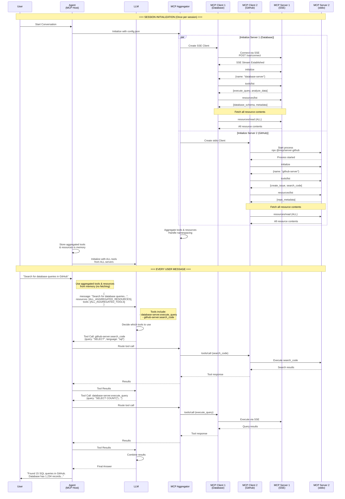

# Multi-MCP Server Support Implementation Plan

## Executive Summary

This plan outlines the implementation of multi-MCP server support through JSON configuration, enabling dynamic server management without code changes. The system will aggregate tools and resources from multiple MCP servers using different transport protocols (SSE, stdio, HTTP).

## Architecture Overview

### Core Design Principles
- **Plugin-based architecture** with JSON configuration
- **Zero code changes** for adding/removing servers
- **Namespace isolation** to prevent conflicts
- **Graceful degradation** on server failures
- **In-memory resource caching** for performance

### System Components
1. **Configuration Loader** - JSON parsing with environment variable substitution
2. **MCP Client Factory** - Creates transport-specific clients
3. **Server Registry** - Manages active server connections
4. **MCP Aggregator** - Unified interface for all servers
5. **FastAPI Integration** - Updates to existing backend

### Multi-Server Flow Sequence Diagram



This diagram illustrates:
- **Session initialization**: Parallel server connections and resource fetching
- **Tool/resource aggregation**: Combining capabilities from all servers
- **Message processing**: Using aggregated tools without re-fetching
- **Tool routing**: Directing calls to appropriate servers
- **Response combination**: Merging results from multiple servers

## Files to be Created/Modified

### New Files
```
fastapi_server/
├── mcp/
│   ├── __init__.py
│   ├── config_loader.py         # Configuration management
│   ├── client_factory.py        # MCP client creation
│   ├── server_registry.py       # Server lifecycle management
│   ├── aggregator.py            # Tool/resource aggregation
│   ├── clients/
│   │   ├── __init__.py
│   │   ├── base_client.py      # Abstract base class
│   │   ├── sse_client.py       # SSE transport implementation
│   │   ├── stdio_client.py     # Stdio transport implementation
│   │   └── http_client.py      # HTTP transport implementation
│   └── models.py                # Pydantic models for configuration

config/
├── mcp-servers.json            # Main configuration file
└── mcp-servers.example.json    # Example with all options

tests/
├── test_mcp_config_loader.py
├── test_mcp_client_factory.py
├── test_mcp_aggregator.py
├── test_mcp_integration.py
└── test_multi_server_e2e.py
```

### Modified Files
```
fastapi_server/
├── main.py                      # Update initialization
├── chat_handler.py             # Use aggregator instead of single client
├── config.py                   # Add multi-server configuration path
└── requirements.txt            # Add new dependencies

.env.example                    # Document new environment variables
README.md                       # Update documentation
```

## Development Phases

### Phase 1: Configuration System & Core Infrastructure
**Duration**: 2-3 days
**Focus**: Configuration loading, validation, environment substitution
**Deliverables**: 
- JSON configuration schema and loader
- Environment variable substitution
- Pydantic v2 models
- Unit tests for configuration

### Phase 2: MCP Client Implementation & Registry
**Duration**: 3-4 days  
**Focus**: Transport-specific clients and server registry
**Deliverables**:
- Base client interface
- SSE, stdio, HTTP client implementations
- Server registry with lifecycle management
- Unit tests for clients and registry

### Phase 3: Aggregation Layer & Routing
**Duration**: 2-3 days
**Focus**: Tool/resource aggregation and namespacing
**Deliverables**:
- Tool aggregation with conflict resolution
- Resource aggregation and caching
- Tool execution routing
- Integration tests for aggregation

### Phase 4: FastAPI Integration & End-to-End Testing
**Duration**: 2-3 days
**Focus**: Integration with existing backend
**Deliverables**:
- FastAPI backend updates
- Multi-server E2E tests
- Documentation updates
- Performance validation

## Cross-Phase Integration Points

### Configuration → Client Factory
- Configuration provides server specs
- Factory consumes transport type and settings
- Validation errors propagate for clear debugging

### Client Factory → Registry
- Factory creates client instances
- Registry manages client lifecycle
- Connection state tracked centrally

### Registry → Aggregator
- Registry provides active servers
- Aggregator fetches and combines capabilities
- Updates on server availability changes

### Aggregator → FastAPI
- Aggregator replaces single MCP client
- Minimal changes to existing chat handler
- Backward compatibility maintained

## Testing Strategy

### Unit Testing
- Each component tested in isolation
- Mock external dependencies
- 90%+ code coverage target

### Integration Testing
- Multi-server scenarios
- Transport protocol variations
- Failure recovery paths

### End-to-End Testing
- Full stack validation
- Performance benchmarks
- Stress testing with multiple servers

### Test Data
- Sample configuration files
- Mock MCP server responses
- Simulated failure scenarios

## Documentation Requirements

### Code Documentation
- Docstrings for all public methods
- Inline comments for complex algorithms
- Type hints throughout

### User Documentation
- Configuration guide with examples
- Migration guide from single server
- Troubleshooting guide

### Developer Documentation
- Architecture diagrams
- Sequence diagrams for key flows
- API reference for new components

## Risk Mitigation

### Technical Risks
1. **Transport protocol incompatibilities**
   - Mitigation: Extensive protocol testing
   - Fallback: Limit initial support to SSE

2. **Performance degradation**
   - Mitigation: Resource caching, connection pooling
   - Monitoring: Add performance metrics

3. **Configuration complexity**
   - Mitigation: Clear examples, validation messages
   - Tool: Configuration validator utility

### Operational Risks
1. **Server connection failures**
   - Mitigation: Graceful degradation
   - Recovery: Automatic reconnection logic

2. **Tool name conflicts**
   - Mitigation: Namespace enforcement
   - UI: Clear conflict warnings

## Success Criteria

### Functional Requirements
- [ ] Support 3+ MCP servers simultaneously
- [ ] All transport protocols functional
- [ ] Zero code changes for server addition
- [ ] Tool/resource aggregation working
- [ ] Graceful degradation on failures

### Performance Requirements
- [ ] < 2 second initialization for 5 servers
- [ ] < 100ms tool routing overhead
- [ ] < 500MB memory for 10 servers
- [ ] No performance regression in single-server mode

### Quality Requirements
- [ ] 90%+ test coverage
- [ ] All critical paths tested
- [ ] Documentation complete
- [ ] No breaking changes to existing API

## Timeline Summary

**Total Duration**: 10-13 days

- Phase 1: Days 1-3 (Configuration System)
- Phase 2: Days 4-7 (Clients & Registry)
- Phase 3: Days 8-10 (Aggregation)
- Phase 4: Days 11-13 (Integration & Testing)

## Dependencies

### External Libraries
- `pydantic>=2.0` - Configuration validation
- `httpx` - HTTP/SSE client
- `pytest-asyncio` - Async testing
- Existing MCP SDK

### Environment Variables
- Server-specific tokens (GITHUB_TOKEN, etc.)
- API endpoints
- Authentication credentials

## Next Steps

1. All 4 phases completed.

## Notes

- Maintain backward compatibility
- Focus on MVP features first
- Defer advanced features (hot-reload, UI)
- Keep configuration simple and intuitive