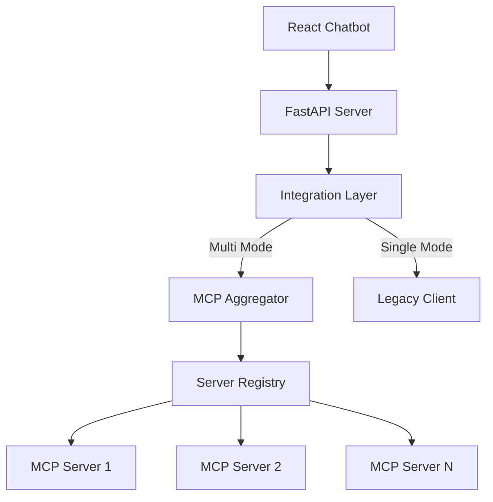

# Phase 4: FastAPI Integration & Complete System Testing

## Phase Overview

### Objective
Integrate the multi-MCP server aggregator with the existing FastAPI backend, maintain backward compatibility, add monitoring endpoints, and perform comprehensive end-to-end testing of the complete system.

### Scope
- FastAPI server modifications for aggregator integration
- Chat handler updates for multi-server support
- Backward compatibility layer
- Health and monitoring endpoints
- Comprehensive E2E testing with React frontend
- Performance validation and optimization
- Complete documentation updates

### Prerequisites
- Phases 1-3 completed and tested
- Existing FastAPI server functional
- React chatbot frontend operational
- Test MCP servers available

### Success Criteria
- ✅ Existing single-server mode still works
- ✅ Multi-server configuration functional
- ✅ Zero breaking changes to API
- ✅ E2E tests pass with React frontend
- ✅ Performance within 10% of single-server
- ✅ >90% overall test coverage
- ✅ Complete documentation updated

## Architectural Guidance

### Design Patterns
- **Adapter Pattern**: Bridge existing code with aggregator
- **Strategy Pattern**: Single vs multi-server modes
- **Facade Pattern**: Simplified API for agent
- **Observer Pattern**: Health monitoring

### Integration Points
```
React Chatbot
      ↓
FastAPI Server (main.py)
      ↓
Chat Handler (chat_handler.py)
      ↓
MCP Integration Layer (NEW)
   ↙        ↘
Legacy Mode   Aggregator Mode
(single MCP)  (multi MCP)
```

### Code Structure Updates
```
fastapi_server/
├── main.py                    # Modified for aggregator
├── chat_handler.py           # Updated for multi-server
├── mcp_integration.py        # NEW: Integration layer
├── health_monitor.py         # NEW: Health endpoints
└── mcp/                      # Phase 1-3 components
    ├── __init__.py
    ├── config_loader.py
    ├── client_factory.py
    ├── server_registry.py
    ├── aggregator.py
    └── clients/

tests/
├── test_fastapi_integration.py
├── test_e2e_multi_server.py
├── test_backward_compatibility.py
└── test_performance.py
```

## Detailed Implementation Tasks

### Task 1: Create Integration Layer
- [ ] Design integration adapter
- [ ] Support both single and multi modes
- [ ] Maintain API compatibility
- [ ] Add configuration detection
- [ ] Write integration layer tests

#### Implementation Algorithm
```
ALGORITHM: MCPIntegrationLayer

from typing import Union, List, Dict, Optional
import os
from pathlib import Path

class MCPIntegrationLayer:
    """Adapter between FastAPI and MCP (single or multi)"""
    
    def __init__(self):
        self.mode = None  # 'single' or 'multi'
        self.aggregator = None
        self.legacy_client = None
        self._initialized = False
    
    async def initialize(self) -> bool:
        """Auto-detect and initialize appropriate mode"""
        
        # Check for multi-server config
        config_paths = [
            os.getenv("MCP_CONFIG_PATH"),
            "config/mcp-servers.json",
            "/etc/mcp/servers.json"
        ]
        
        multi_config = None
        for path in config_paths:
            if path and Path(path).exists():
                multi_config = path
                break
        
        if multi_config:
            # Multi-server mode
            return await self._init_multi_mode(multi_config)
        else:
            # Legacy single-server mode
            return await self._init_single_mode()
    
    async def _init_multi_mode(self, config_path: str) -> bool:
        """Initialize multi-server aggregator"""
        try:
            log.info(f"Initializing multi-server mode from {config_path}")
            
            from mcp.aggregator import MCPAggregator
            
            self.aggregator = MCPAggregator(config_path)
            success = await self.aggregator.initialize()
            
            if success:
                self.mode = "multi"
                self._initialized = True
                
                # Log status
                status = self.aggregator.get_status()
                log.info(
                    f"Multi-server mode active: "
                    f"{status['servers']['healthy']}/{status['servers']['total']} servers, "
                    f"{status['tools']['total']} tools"
                )
            
            return success
            
        except Exception as e:
            log.error(f"Failed to initialize multi-server mode: {e}")
            log.info("Falling back to single-server mode")
            return await self._init_single_mode()
    
    async def _init_single_mode(self) -> bool:
        """Initialize legacy single-server mode"""
        try:
            log.info("Initializing single-server mode")
            
            # Use existing MCP client code
            from mcp_client import MCPClient
            
            # Get legacy configuration
            mcp_url = os.getenv("MCP_SERVER_URL", "http://localhost:8000/mcp")
            
            self.legacy_client = MCPClient(mcp_url)
            await self.legacy_client.connect()
            
            self.mode = "single"
            self._initialized = True
            
            log.info(f"Single-server mode active: {mcp_url}")
            return True
            
        except Exception as e:
            log.error(f"Failed to initialize single-server mode: {e}")
            return False
    
    async def list_tools(self) -> List[Dict]:
        """List available tools (unified interface)"""
        if not self._initialized:
            raise RuntimeError("MCP integration not initialized")
        
        if self.mode == "multi":
            return self.aggregator.list_tools()
        else:
            return await self.legacy_client.list_tools()
    
    async def list_resources(self) -> List[Dict]:
        """List available resources (unified interface)"""
        if not self._initialized:
            raise RuntimeError("MCP integration not initialized")
        
        if self.mode == "multi":
            return self.aggregator.list_resources()
        else:
            return await self.legacy_client.list_resources()
    
    async def call_tool(self, tool_name: str, arguments: dict) -> dict:
        """Execute tool (unified interface)"""
        if not self._initialized:
            raise RuntimeError("MCP integration not initialized")
        
        if self.mode == "multi":
            result = await self.aggregator.call_tool(tool_name, arguments)
            # Extract result for compatibility
            if isinstance(result, dict) and "result" in result:
                return result["result"]
            return result
        else:
            return await self.legacy_client.call_tool(tool_name, arguments)
    
    def get_resource(self, uri: str) -> Optional[dict]:
        """Get resource content (unified interface)"""
        if not self._initialized:
            raise RuntimeError("MCP integration not initialized")
        
        if self.mode == "multi":
            return self.aggregator.get_resource(uri)
        else:
            # Legacy mode might not have caching
            return self.legacy_client.get_resource(uri)
    
    def get_status(self) -> dict:
        """Get system status"""
        if not self._initialized:
            return {"initialized": False, "mode": None}
        
        if self.mode == "multi":
            return self.aggregator.get_status()
        else:
            # Create compatible status for single mode
            return {
                "initialized": True,
                "mode": "single",
                "servers": {
                    "total": 1,
                    "healthy": 1 if self.legacy_client.connected else 0
                },
                "tools": {"total": len(self.legacy_client.tools or [])},
                "resources": {"total": len(self.legacy_client.resources or [])}
            }
    
    async def shutdown(self):
        """Graceful shutdown"""
        if self.mode == "multi":
            await self.aggregator.shutdown()
        elif self.legacy_client:
            await self.legacy_client.disconnect()
        
        self._initialized = False

# Integration Tests
class TestMCPIntegration:
    async def test_multi_mode_detection(self, config_file):
        """Test automatic multi-mode detection"""
        os.environ["MCP_CONFIG_PATH"] = config_file
        
        integration = MCPIntegrationLayer()
        assert await integration.initialize()
        assert integration.mode == "multi"
    
    async def test_single_mode_fallback(self):
        """Test fallback to single mode"""
        # No config file present
        os.environ.pop("MCP_CONFIG_PATH", None)
        
        integration = MCPIntegrationLayer()
        assert await integration.initialize()
        assert integration.mode == "single"
    
    async def test_unified_interface(self):
        """Test same interface for both modes"""
        integration = MCPIntegrationLayer()
        await integration.initialize()
        
        # These should work regardless of mode
        tools = await integration.list_tools()
        resources = await integration.list_resources()
        status = integration.get_status()
        
        assert isinstance(tools, list)
        assert isinstance(resources, list)
        assert "initialized" in status
```

### Task 2: Update FastAPI Main
- [ ] Integrate MCP layer at startup
- [ ] Add health endpoints
- [ ] Update CORS for multi-server
- [ ] Add graceful shutdown
- [ ] Write startup/shutdown tests

#### Implementation Algorithm
```
ALGORITHM: UpdateFastAPIMain

# main.py modifications

from fastapi import FastAPI, HTTPException
from fastapi.middleware.cors import CORSMiddleware
from contextlib import asynccontextmanager
import signal
import sys

# Import new integration layer
from mcp_integration import MCPIntegrationLayer

# Global MCP integration instance
mcp_integration = MCPIntegrationLayer()

@asynccontextmanager
async def lifespan(app: FastAPI):
    """Manage application lifecycle"""
    # Startup
    log.info("Starting FastAPI server with MCP integration")
    
    # Initialize MCP
    if not await mcp_integration.initialize():
        log.error("Failed to initialize MCP integration")
        sys.exit(1)
    
    # Log configuration
    status = mcp_integration.get_status()
    log.info(f"MCP Mode: {status.get('mode', 'unknown')}")
    log.info(f"Servers: {status.get('servers', {})}")
    
    # Setup signal handlers
    def handle_shutdown(signum, frame):
        log.info(f"Received signal {signum}, initiating shutdown")
        asyncio.create_task(graceful_shutdown())
    
    signal.signal(signal.SIGTERM, handle_shutdown)
    signal.signal(signal.SIGINT, handle_shutdown)
    
    yield
    
    # Shutdown
    log.info("Shutting down FastAPI server")
    await mcp_integration.shutdown()
    log.info("Shutdown complete")

async def graceful_shutdown():
    """Graceful shutdown procedure"""
    # Complete ongoing requests
    await asyncio.sleep(1)
    
    # Shutdown MCP connections
    await mcp_integration.shutdown()
    
    # Exit
    sys.exit(0)

# Create FastAPI app with lifespan
app = FastAPI(
    title="Multi-MCP Chat API",
    version="2.0.0",
    lifespan=lifespan
)

# Update CORS for potential multi-server origins
app.add_middleware(
    CORSMiddleware,
    allow_origins=["http://localhost:3000", "*"],  # Configure as needed
    allow_credentials=True,
    allow_methods=["*"],
    allow_headers=["*"],
)

# Health check endpoint
@app.get("/health")
async def health_check():
    """Basic health check"""
    status = mcp_integration.get_status()
    
    if not status.get("initialized"):
        raise HTTPException(status_code=503, detail="MCP not initialized")
    
    return {
        "status": "healthy",
        "mode": status.get("mode"),
        "servers": status.get("servers", {}).get("healthy", 0)
    }

# Detailed health endpoint
@app.get("/health/detailed")
async def detailed_health():
    """Detailed system health"""
    return mcp_integration.get_status()

# MCP tools endpoint
@app.get("/mcp/tools")
async def list_tools():
    """List all available MCP tools"""
    try:
        tools = await mcp_integration.list_tools()
        return {"tools": tools, "count": len(tools)}
    except Exception as e:
        raise HTTPException(status_code=500, detail=str(e))

# MCP resources endpoint
@app.get("/mcp/resources")
async def list_resources():
    """List all available MCP resources"""
    try:
        resources = await mcp_integration.list_resources()
        return {"resources": resources, "count": len(resources)}
    except Exception as e:
        raise HTTPException(status_code=500, detail=str(e))

# Metrics endpoint
@app.get("/metrics")
async def get_metrics():
    """Prometheus-compatible metrics"""
    status = mcp_integration.get_status()
    
    metrics = []
    
    # Server metrics
    if "servers" in status:
        metrics.append(f"mcp_servers_total {status['servers'].get('total', 0)}")
        metrics.append(f"mcp_servers_healthy {status['servers'].get('healthy', 0)}")
    
    # Tool metrics
    if "tools" in status:
        metrics.append(f"mcp_tools_total {status['tools'].get('total', 0)}")
    
    # Resource metrics
    if "resources" in status:
        metrics.append(f"mcp_resources_total {status['resources'].get('total', 0)}")
        
        if "cache" in status["resources"]:
            cache = status["resources"]["cache"]
            metrics.append(f"mcp_cache_entries {cache.get('entries', 0)}")
            metrics.append(f"mcp_cache_size_bytes {cache.get('size_bytes', 0)}")
    
    return "\n".join(metrics)

# Tests for main.py updates
class TestFastAPIMain:
    async def test_startup_sequence(self):
        """Test application startup"""
        from fastapi.testclient import TestClient
        
        with TestClient(app) as client:
            response = client.get("/health")
            assert response.status_code == 200
            assert response.json()["status"] == "healthy"
    
    async def test_graceful_shutdown(self):
        """Test graceful shutdown handling"""
        # Start server
        # Send SIGTERM
        # Verify clean shutdown
    
    async def test_health_endpoints(self):
        """Test health check endpoints"""
        # Test basic health
        # Test detailed health
        # Test metrics format
```

### Task 3: Update Chat Handler
- [ ] Modify for multi-server tools
- [ ] Update resource handling
- [ ] Add server context to responses
- [ ] Maintain message format
- [ ] Write chat handler tests

#### Implementation Algorithm
```
ALGORITHM: UpdateChatHandler

# chat_handler.py modifications

from typing import Dict, List, Any
import json

class ChatHandler:
    def __init__(self, llm_client, mcp_integration):
        self.llm_client = llm_client
        self.mcp = mcp_integration
        self._tools_cache = None
        self._resources_cache = None
    
    async def initialize(self):
        """Initialize handler with MCP capabilities"""
        # Cache tools and resources
        self._tools_cache = await self.mcp.list_tools()
        self._resources_cache = await self.mcp.list_resources()
        
        log.info(
            f"Chat handler initialized with {len(self._tools_cache)} tools, "
            f"{len(self._resources_cache)} resources"
        )
    
    async def process_message(self, user_message: str) -> Dict:
        """Process user message with multi-server support"""
        
        # Refresh caches if needed
        if not self._tools_cache:
            await self.initialize()
        
        # Build context for LLM
        context = self._build_llm_context(user_message)
        
        # Get LLM response
        llm_response = await self.llm_client.generate(context)
        
        # Process tool calls if any
        if tool_calls := llm_response.get("tool_calls"):
            tool_results = await self._execute_tools(tool_calls)
            
            # Add results to context
            context["tool_results"] = tool_results
            
            # Get final response
            final_response = await self.llm_client.generate(context)
            
            return {
                "response": final_response["content"],
                "tools_used": [t["name"] for t in tool_calls],
                "metadata": self._get_response_metadata(tool_calls)
            }
        
        return {
            "response": llm_response["content"],
            "tools_used": [],
            "metadata": {}
        }
    
    def _build_llm_context(self, user_message: str) -> Dict:
        """Build context with multi-server awareness"""
        
        # Format tools for LLM
        formatted_tools = []
        for tool in self._tools_cache:
            # Include server context if in multi mode
            tool_def = {
                "name": tool.get("namespaced_name", tool["name"]),
                "description": tool.get("description", ""),
                "parameters": tool.get("schema", {})
            }
            
            # Add server hint if available
            if server := tool.get("server_name"):
                tool_def["description"] += f" (from {server})"
            
            formatted_tools.append(tool_def)
        
        # Format resources
        formatted_resources = []
        for resource in self._resources_cache:
            res_def = {
                "uri": resource.get("namespaced_uri", resource["uri"]),
                "description": resource.get("description", ""),
                "content": resource.get("content", "")[:1000]  # Truncate
            }
            
            if server := resource.get("server_name"):
                res_def["server"] = server
            
            formatted_resources.append(res_def)
        
        return {
            "message": user_message,
            "tools": formatted_tools,
            "resources": formatted_resources,
            "system_prompt": self._get_system_prompt()
        }
    
    def _get_system_prompt(self) -> str:
        """Generate system prompt with multi-server context"""
        status = self.mcp.get_status()
        
        if status.get("mode") == "multi":
            servers = status.get("servers", {})
            return (
                f"You have access to {servers.get('healthy', 0)} MCP servers "
                f"with {status['tools']['total']} tools. "
                "Use namespaced tool names (server.tool) when conflicts exist. "
                "Resources are cached and immediately available."
            )
        else:
            return (
                "You have access to MCP tools and resources. "
                "Use them to help answer user queries."
            )
    
    async def _execute_tools(self, tool_calls: List[Dict]) -> List[Dict]:
        """Execute tools with multi-server routing"""
        results = []
        
        for call in tool_calls:
            try:
                # Execute through integration layer
                result = await self.mcp.call_tool(
                    call["name"],
                    call.get("arguments", {})
                )
                
                results.append({
                    "tool": call["name"],
                    "result": result,
                    "success": True
                })
                
            except Exception as e:
                log.error(f"Tool execution failed: {call['name']}: {e}")
                results.append({
                    "tool": call["name"],
                    "error": str(e),
                    "success": False
                })
        
        return results
    
    def _get_response_metadata(self, tool_calls: List[Dict]) -> Dict:
        """Generate metadata about tool usage"""
        metadata = {
            "mode": self.mcp.get_status().get("mode"),
            "tools_called": len(tool_calls)
        }
        
        # In multi mode, track which servers were used
        if metadata["mode"] == "multi":
            servers_used = set()
            for call in tool_calls:
                if "." in call["name"]:
                    server = call["name"].split(".")[0]
                    servers_used.add(server)
            
            metadata["servers_used"] = list(servers_used)
        
        return metadata

# Chat handler tests
class TestChatHandler:
    async def test_multi_server_context(self):
        """Test context building with multiple servers"""
        # Create handler with multi-server MCP
        # Verify context includes server info
    
    async def test_tool_execution_routing(self):
        """Test tool calls route to correct servers"""
        # Call namespaced tools
        # Verify correct routing
    
    async def test_backward_compatibility(self):
        """Test single-server mode still works"""
        # Use legacy configuration
        # Verify same API behavior
```

### Task 4: End-to-End Testing
- [ ] Create multi-server test environment
- [ ] Test with React frontend
- [ ] Validate all user flows
- [ ] Performance benchmarking
- [ ] Write comprehensive E2E tests

#### Implementation Algorithm
```
ALGORITHM: EndToEndTesting

# test_e2e_multi_server.py

import pytest
import asyncio
from playwright.async_api import async_playwright
import docker
import time

class TestE2EMultiServer:
    @pytest.fixture
    async def test_environment(self):
        """Setup complete test environment"""
        
        # Start test MCP servers using Docker
        client = docker.from_env()
        containers = []
        
        # Start database MCP server
        db_container = client.containers.run(
            "mcp-database-server",
            ports={"8000/tcp": 8000},
            detach=True
        )
        containers.append(db_container)
        
        # Start GitHub MCP server (mock)
        github_container = client.containers.run(
            "mcp-github-mock",
            ports={"8001/tcp": 8001},
            detach=True
        )
        containers.append(github_container)
        
        # Start filesystem MCP server
        fs_container = client.containers.run(
            "mcp-filesystem-server",
            ports={"8002/tcp": 8002},
            detach=True
        )
        containers.append(fs_container)
        
        # Wait for servers to be ready
        await self._wait_for_servers([8000, 8001, 8002])
        
        # Create multi-server config
        config = {
            "version": "1.0",
            "servers": [
                {
                    "name": "database",
                    "transport": "http",
                    "config": {"endpoint": "http://localhost:8000"}
                },
                {
                    "name": "github",
                    "transport": "http",
                    "config": {"endpoint": "http://localhost:8001"}
                },
                {
                    "name": "filesystem",
                    "transport": "http",
                    "config": {"endpoint": "http://localhost:8002"}
                }
            ]
        }
        
        # Write config
        with open("test-mcp-config.json", "w") as f:
            json.dump(config, f)
        
        # Start FastAPI server
        fastapi_process = await asyncio.create_subprocess_exec(
            "python", "-m", "fastapi_server.main",
            env={**os.environ, "MCP_CONFIG_PATH": "test-mcp-config.json"}
        )
        
        # Start React frontend
        react_process = await asyncio.create_subprocess_exec(
            "npm", "start",
            cwd="react-chatbot"
        )
        
        yield
        
        # Cleanup
        fastapi_process.terminate()
        react_process.terminate()
        
        for container in containers:
            container.stop()
            container.remove()
    
    async def _wait_for_servers(self, ports: List[int], timeout: int = 30):
        """Wait for servers to be ready"""
        import httpx
        
        start = time.time()
        
        for port in ports:
            while time.time() - start < timeout:
                try:
                    async with httpx.AsyncClient() as client:
                        response = await client.get(f"http://localhost:{port}/health")
                        if response.status_code == 200:
                            break
                except:
                    await asyncio.sleep(1)
            else:
                raise TimeoutError(f"Server on port {port} not ready")
    
    async def test_multi_server_query(self, test_environment):
        """Test query that uses multiple servers"""
        
        async with async_playwright() as p:
            browser = await p.chromium.launch()
            page = await browser.new_page()
            
            # Navigate to React app
            await page.goto("http://localhost:3000")
            
            # Wait for app to load
            await page.wait_for_selector(".chat-interface")
            
            # Send query that requires multiple servers
            await page.fill(
                ".message-input",
                "Search GitHub for database queries and run them"
            )
            await page.press(".message-input", "Enter")
            
            # Wait for response
            await page.wait_for_selector(".message-response", timeout=30000)
            
            # Verify response uses multiple servers
            response = await page.text_content(".message-response")
            
            # Check metadata shows multiple servers used
            metadata = await page.text_content(".message-metadata")
            assert "database" in metadata
            assert "github" in metadata
            
            await browser.close()
    
    async def test_server_failure_handling(self, test_environment):
        """Test graceful degradation when server fails"""
        
        # Stop one server mid-operation
        docker_client = docker.from_env()
        github_container = docker_client.containers.get("mcp-github-mock")
        
        async with async_playwright() as p:
            browser = await p.chromium.launch()
            page = await browser.new_page()
            await page.goto("http://localhost:3000")
            
            # Send query
            await page.fill(".message-input", "List all tools available")
            await page.press(".message-input", "Enter")
            
            # Stop GitHub server
            github_container.stop()
            
            # Send another query
            await page.fill(
                ".message-input",
                "Run a database query"
            )
            await page.press(".message-input", "Enter")
            
            # Should still work with remaining servers
            await page.wait_for_selector(".message-response")
            
            # Verify degraded mode indicated
            health = await self._check_api_health()
            assert health["servers"]["healthy"] == 2  # One server down
            
            await browser.close()
    
    async def _check_api_health(self) -> dict:
        """Check FastAPI health endpoint"""
        import httpx
        
        async with httpx.AsyncClient() as client:
            response = await client.get("http://localhost:8001/health/detailed")
            return response.json()
    
    async def test_performance_benchmark(self, test_environment):
        """Benchmark multi-server performance"""
        import httpx
        import statistics
        
        async with httpx.AsyncClient() as client:
            # Warm up
            for _ in range(5):
                await client.post(
                    "http://localhost:8001/chat",
                    json={"message": "test"}
                )
            
            # Benchmark
            latencies = []
            
            for _ in range(50):
                start = time.time()
                
                response = await client.post(
                    "http://localhost:8001/chat",
                    json={"message": "List available tools"}
                )
                
                latencies.append(time.time() - start)
            
            # Analyze results
            avg_latency = statistics.mean(latencies)
            p95_latency = statistics.quantiles(latencies, n=20)[18]
            
            # Performance requirements
            assert avg_latency < 1.0  # Average under 1 second
            assert p95_latency < 2.0  # 95th percentile under 2 seconds
            
            print(f"Average latency: {avg_latency:.3f}s")
            print(f"P95 latency: {p95_latency:.3f}s")
    
    async def test_backward_compatibility(self):
        """Test single-server mode still works"""
        
        # Start without multi-server config
        os.environ.pop("MCP_CONFIG_PATH", None)
        
        # Start single MCP server
        process = await asyncio.create_subprocess_exec(
            "python", "-m", "talk_2_tables_mcp.server",
            "--transport", "sse"
        )
        
        # Start FastAPI (should detect single mode)
        fastapi = await asyncio.create_subprocess_exec(
            "python", "-m", "fastapi_server.main"
        )
        
        await asyncio.sleep(5)
        
        # Test API works
        import httpx
        async with httpx.AsyncClient() as client:
            response = await client.get("http://localhost:8001/health")
            assert response.json()["mode"] == "single"
            
            # Test chat works
            response = await client.post(
                "http://localhost:8001/chat",
                json={"message": "Execute a query"}
            )
            assert response.status_code == 200
        
        # Cleanup
        process.terminate()
        fastapi.terminate()

# Performance comparison test
class TestPerformanceComparison:
    async def test_single_vs_multi_performance(self):
        """Compare single vs multi server performance"""
        
        single_latencies = await self._benchmark_mode("single")
        multi_latencies = await self._benchmark_mode("multi")
        
        single_avg = statistics.mean(single_latencies)
        multi_avg = statistics.mean(multi_latencies)
        
        # Multi-server overhead should be minimal
        overhead = (multi_avg - single_avg) / single_avg
        assert overhead < 0.1  # Less than 10% overhead
        
        print(f"Single mode avg: {single_avg:.3f}s")
        print(f"Multi mode avg: {multi_avg:.3f}s")
        print(f"Overhead: {overhead:.1%}")
    
    async def _benchmark_mode(self, mode: str) -> List[float]:
        """Benchmark specific mode"""
        # Setup appropriate configuration
        # Run benchmark queries
        # Return latencies
```

### Task 5: Documentation Updates
- [ ] Update README with multi-server setup
- [ ] Create migration guide
- [ ] Document configuration schema
- [ ] Add troubleshooting section
- [ ] Create architecture diagrams

#### Documentation Structure
```
DOCUMENTATION: MultiServerGuide

# Multi-MCP Server Configuration Guide

## Quick Start

### Single to Multi Migration

1. Create configuration file:
```json
{
  "version": "1.0",
  "servers": [
    {
      "name": "your-existing-server",
      "transport": "sse",
      "config": {
        "endpoint": "${MCP_SERVER_URL}"
      }
    }
  ]
}
```

2. Set environment variable:
```bash
export MCP_CONFIG_PATH=config/mcp-servers.json
```

3. Restart FastAPI server - it will auto-detect multi mode

### Adding New Servers

Simply add to the servers array:
```json
{
  "name": "new-server",
  "transport": "stdio",
  "config": {
    "command": "npx",
    "args": ["@modelcontextprotocol/server-new"]
  }
}
```

## Configuration Reference

### Server Configuration
| Field | Type | Required | Description |
|-------|------|----------|-------------|
| name | string | Yes | Unique server identifier |
| enabled | boolean | No | Enable/disable server (default: true) |
| transport | string | Yes | Transport type: sse, stdio, http |
| priority | integer | No | Conflict resolution priority |
| config | object | Yes | Transport-specific configuration |

### Transport Configurations

#### SSE Transport
```json
{
  "endpoint": "http://localhost:8000",
  "headers": {"Authorization": "Bearer ${TOKEN}"},
  "timeout": 30000
}
```

#### Stdio Transport
```json
{
  "command": "python",
  "args": ["server.py"],
  "env": {"API_KEY": "${API_KEY}"}
}
```

#### HTTP Transport
```json
{
  "endpoint": "https://api.example.com",
  "api_key": "${API_KEY}",
  "headers": {"X-Custom": "value"}
}
```

## Tool Namespacing

When multiple servers provide the same tool:

- Use namespaced format: `server.tool_name`
- Example: `database.execute_query`
- Bare names use highest priority server

## Monitoring

### Health Endpoints
- `/health` - Basic health check
- `/health/detailed` - Full system status
- `/metrics` - Prometheus metrics

### Logging
```bash
# Enable debug logging
export LOG_LEVEL=DEBUG

# View aggregator logs
tail -f logs/mcp-aggregator.log
```

## Troubleshooting

### Server Won't Connect
1. Check server is running
2. Verify endpoint/command correct
3. Check authentication/env vars
4. Review logs for errors

### Tool Conflicts
1. Use namespaced tool names
2. Adjust server priorities
3. Disable conflicting server

### Performance Issues
1. Check server health status
2. Review cache statistics
3. Monitor circuit breakers
4. Analyze routing metrics

## Architecture Diagram


```

## Quality Assurance

### Complete Test Suite
- Unit tests: Each component isolated
- Integration tests: Component interactions
- E2E tests: Full system with UI
- Performance tests: Latency and throughput
- Compatibility tests: Single/multi modes

### Test Coverage Requirements
- Overall: >90% coverage
- Critical paths: 100% coverage
- Error handling: All paths tested
- Edge cases: Documented and tested

### Performance Validation
- Startup time: <5 seconds with 5 servers
- Request latency: <100ms overhead
- Memory usage: <50MB per server
- Cache efficiency: >80% hit rate

## Junior Developer Support

### Common Integration Issues
1. **Import Errors**: Ensure all phases complete
2. **Async Deadlocks**: Use proper await patterns
3. **Config Not Found**: Check environment variables
4. **Mode Detection**: Verify config file location

### Debugging Integration
```python
# Enable verbose logging
import logging
logging.basicConfig(level=logging.DEBUG)

# Check integration state
print(mcp_integration.get_status())

# Test specific server
await mcp_integration.aggregator.registry.get_server("test")

# Manual mode override
mcp_integration.mode = "multi"  # Force multi mode
```

## Deliverables

### Files to Create/Modify
```
fastapi_server/
├── mcp_integration.py      # NEW: ~250 lines
├── health_monitor.py       # NEW: ~150 lines
├── main.py                # MODIFIED: +100 lines
├── chat_handler.py        # MODIFIED: +50 lines

tests/
├── test_fastapi_integration.py      # ~300 lines
├── test_e2e_multi_server.py        # ~500 lines
├── test_backward_compatibility.py   # ~200 lines
└── test_performance.py              # ~200 lines

docs/
├── MULTI_SERVER_GUIDE.md           # ~500 lines
├── MIGRATION_GUIDE.md              # ~200 lines
└── TROUBLESHOOTING.md              # ~300 lines
```

### Documentation Deliverables
- Complete configuration reference
- Migration guide from single to multi
- Troubleshooting guide with solutions
- Architecture diagrams and flow charts
- Performance tuning guide

### Validation Checklist
- [ ] All existing tests still pass
- [ ] Multi-server E2E tests pass
- [ ] Performance within requirements
- [ ] Documentation complete
- [ ] No breaking API changes
- [ ] React UI fully functional
- [ ] Monitoring endpoints operational
- [ ] Graceful degradation verified

## Post-Implementation Notes

### Maintenance Considerations
- Regular health check monitoring
- Log rotation for aggregator logs
- Cache size management
- Connection pool optimization

### Future Enhancements
- Hot-reload configuration changes
- Dynamic server discovery
- Advanced load balancing
- Distributed caching
- WebSocket support for real-time updates