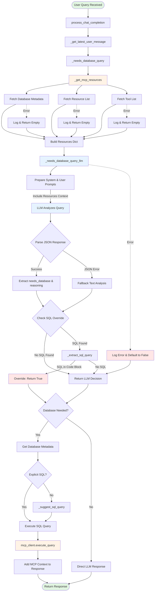

# LLM-Based Database Query Decision Flow

## Overview
This document describes the flow of the LLM-based system that determines whether a user query requires database access. The system replaces the previous keyword/regex-based approach with intelligent LLM analysis.

## Architecture Flow Diagram



## Detailed Component Descriptions

### 1. Entry Point: `process_chat_completion`
- Receives chat completion request
- Extracts latest user message
- Initiates database need check

### 2. Resource Fetching: `_get_mcp_resources`
- **No Caching**: Fresh fetch on every request
- Fetches three resource types in parallel:
  - **Database Metadata**: Table schemas, columns, descriptions
  - **Available Resources**: MCP resource endpoints
  - **Available Tools**: MCP tools like `execute_query`
- Returns structured dictionary with all resources
- Handles errors gracefully with empty defaults

### 3. LLM Decision Making: `_needs_database_query_llm`
- Constructs intelligent prompts with:
  - System prompt explaining available database resources
  - User query for analysis
  - Table schemas and available tools as context
- Requests structured JSON response:
  ```json
  {
    "needs_database": true/false,
    "reasoning": "explanation",
    "confidence": "high/medium/low"
  }
  ```
- Fallback to text analysis if JSON parsing fails

### 4. SQL Override Check: `_extract_sql_query`
- Looks for explicit SQL in code blocks:
  - ` ```sql ... ``` `
  - ` ```SELECT ... ``` `
  - Inline: `` `SELECT ...` ``
- Overrides LLM decision if explicit SQL found
- Ensures user intent is respected

### 5. Error Handling
- Each component has independent error handling
- Failures log detailed error messages
- System defaults to "no database access" on LLM failure
- MCP connection failures return empty resources

## Key Features

### Intelligent Context-Aware Decision
- LLM receives full database schema context
- Understands table relationships and available data
- Makes informed decisions based on actual capabilities

### Extensive Logging
- Every major step logs progress
- Debug-level logs for detailed troubleshooting
- Error logs with full context

### No Caching (Per Requirements)
- Resources fetched fresh on every request
- Ensures up-to-date database metadata
- No stale data issues

### Clean Architecture
- No regex patterns or keyword matching
- Pure LLM-based intelligence
- SQL extraction only for explicit code blocks

## Resource Object Structure

The resources object passed to LLM contains:

```javascript
{
  "database_metadata": {
    "server_name": "talk-2-tables-mcp",
    "database_path": "test_data/sample.db",
    "tables": {
      "customers": { /* columns, descriptions, sample queries */ },
      "products": { /* columns, descriptions, sample queries */ },
      "orders": { /* columns, descriptions, sample queries */ },
      "order_items": { /* columns, descriptions, sample queries */ }
    }
  },
  "available_resources": [
    {
      "name": "get_database_metadata",
      "uri": "database://metadata",
      "description": "..."
    }
  ],
  "available_tools": [
    {
      "name": "execute_query",
      "description": "Execute a SELECT query on the database..."
    }
  ]
}
```

## Implementation Files

- **Main Handler**: `/root/projects/talk-2-tables-mcp/fastapi_server/chat_handler.py`
- **Key Methods**:
  - `_needs_database_query` (lines 312-349): Main decision orchestrator
  - `_get_mcp_resources` (lines 173-239): Resource fetcher
  - `_needs_database_query_llm` (lines 241-310): LLM decision maker
  - `_extract_sql_query` (lines 351-390): SQL code block extractor

## Testing

Test coverage includes:
- Database-related queries correctly identified
- Non-database queries correctly rejected
- Edge cases (empty queries, long text, emojis)
- Explicit SQL queries always trigger database access
- Error scenarios default safely

## Benefits Over Previous Approach

1. **Intelligent**: Understands context, not just keywords
2. **Adaptive**: Works with any query type
3. **Accurate**: Reduces false positives/negatives
4. **Maintainable**: No regex patterns to update
5. **Extensible**: Easy to add new decision factors
6. **Transparent**: Clear reasoning from LLM